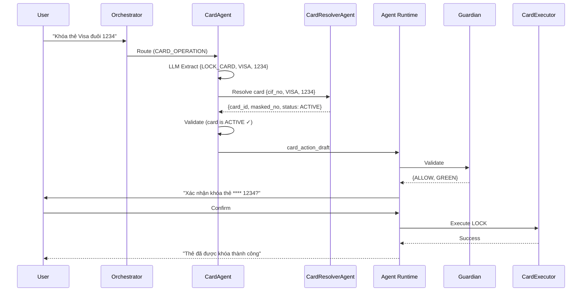

# CardAgent

> Domain Agent responsible for card management operations: lock, unlock, limit change, and card info queries.

---

## 1. Responsibility

CardAgent handles all card-related operations. It resolves the target card (especially when user has multiple cards), builds the operation draft, and returns it for Guardian validation.

| Does | Does NOT |
|------|----------|
| Parse card operation request (LLM extract) | Execute card operations directly |
| Resolve target card (delegate to CardResolverAgent) | Call card service API |
| Handle ambiguity (multiple cards) | Bypass Guardian |
| Build card_action_draft | Approve its own risk |
| Support lock/unlock/limit change workflows | Override Guardian decision |

---

## 2. Pipeline

```text
┌─────────────────────────────────────────────────────────┐
│ 1. RECEIVE ROUTED REQUEST                               │
│    Input: "Khóa thẻ tín dụng Visa đuôi 1234"          │
│    Source: Orchestrator (task_type = CARD_OPERATION)     │
└────────────────────────────┬────────────────────────────┘
                             │
                             ▼
┌─────────────────────────────────────────────────────────┐
│ 2. OPERATION EXTRACTION (LLM call)                      │
│    Output: {                                            │
│      operation: "LOCK_CARD",                            │
│      card_hint: "tín dụng Visa đuôi 1234",             │
│      card_type_filter: "CREDIT",                        │
│      card_network_filter: "VISA",                       │
│      last4_filter: "1234",                              │
│      reason: "USER_REQUEST"                             │
│    }                                                    │
└────────────────────────────┬────────────────────────────┘
                             │
                             ▼
┌─────────────────────────────────────────────────────────┐
│ 3. CARD RESOLUTION (delegate to CardResolverAgent)      │
│    Query user's cards with filters:                     │
│    • card_type = CREDIT                                 │
│    • card_network = VISA                                │
│    • masked_card_no LIKE '%1234'                        │
│    → Single match → use it                             │
│    → Multiple matches → ask user                       │
│    → No match → inform user                            │
└────────────────────────────┬────────────────────────────┘
                             │
                             ▼
┌─────────────────────────────────────────────────────────┐
│ 4. VALIDATION CHECKS                                    │
│    • LOCK: card must be ACTIVE                          │
│    • UNLOCK: card must be LOCKED                        │
│    • LIMIT_CHANGE: card must be CREDIT + ACTIVE         │
│    • New limit must be within bank policy range         │
│    If invalid → return error message to user            │
└────────────────────────────┬────────────────────────────┘
                             │
                             ▼
┌─────────────────────────────────────────────────────────┐
│ 5. BUILD CARD ACTION DRAFT                              │
│    {                                                    │
│      action_type: "CARD_LOCK",                          │
│      card_id, masked_card_no, action, reason,           │
│      new_limit (if LIMIT_CHANGE)                        │
│    }                                                    │
└────────────────────────────┬────────────────────────────┘
                             │
                             ▼
┌─────────────────────────────────────────────────────────┐
│ 6. RETURN TO AGENT RUNTIME                              │
│    → Guardian validates                                 │
│    → Friction: LOCK is typically GREEN (urgent safety)  │
│    → LIMIT_CHANGE is YELLOW+ (financial impact)         │
│    → CardExecutor performs operation                    │
└─────────────────────────────────────────────────────────┘
```

---

## 3. Supported Operations

| Operation | Description | Risk Level | Required Fields |
|-----------|-------------|------------|-----------------|
| LOCK_CARD | Freeze card immediately | GREEN (safety action) | card_id, reason |
| UNLOCK_CARD | Reactivate locked card | YELLOW (verify identity) | card_id |
| CHANGE_CARD_LIMIT | Increase/decrease limit | YELLOW-ORANGE | card_id, new_limit |
| VIEW_CARD_INFO | Show card details | N/A (read-only) | card_id or cif_no |

---

## 4. Card Resolution Logic

```text
CardResolverAgent receives:
{
  task_type: "resolve_card",
  constraints: {
    cif_no: "CIF000001",
    card_type: "CREDIT",        // optional
    card_network: "VISA",       // optional
    last4: "1234"               // optional
  }
}

Resolution priority:
1. If last4 provided → exact match (usually unique)
2. If card_type + network → filter
3. If only 1 card matches → use it
4. If multiple match → return candidates for user choice
5. If user has only 1 card → use it regardless of hints
```

---

## 5. Action Draft Schema

### LOCK_CARD

```json
{
  "action_type": "CARD_LOCK",
  "cif_no": "CIF000001",
  "api_name": "external_card_service_api",
  "api_payload": {
    "card_id": "uuid-card-001",
    "masked_card_no": "**** **** **** 1234",
    "action": "LOCK",
    "reason": "USER_REQUEST"
  }
}
```

### CHANGE_CARD_LIMIT

```json
{
  "action_type": "CARD_LIMIT_CHANGE",
  "cif_no": "CIF000001",
  "api_name": "external_card_service_api",
  "api_payload": {
    "card_id": "uuid-card-001",
    "masked_card_no": "**** **** **** 5678",
    "new_limit": 100000000,
    "currency": "VND"
  }
}
```

---

## 6. Edge Cases

| Scenario | Handling |
|----------|----------|
| User says "khóa thẻ" but has 3 cards | Ask: "Bạn muốn khóa thẻ nào?" + list cards |
| Lock an already locked card | Inform: "Thẻ này đã bị khóa trước đó" |
| Unlock but card is EXPIRED | Inform: "Thẻ đã hết hạn, không thể mở khóa" |
| Limit change on DEBIT card | Inform: "Thẻ ghi nợ không có hạn mức tín dụng" |
| New limit exceeds bank maximum | Inform limit range, ask user to adjust |
| Emergency lock (suspected theft) | Fast-track: skip confirmation, direct to Guardian |

---

## 7. Sequence Diagram


