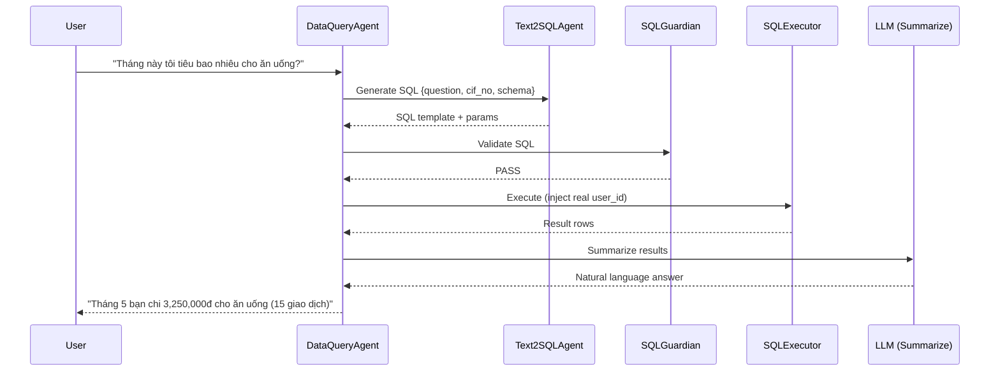

# DataQueryAgent

> Domain Agent responsible for answering user questions about their banking data using Text2SQL pipeline.

---

## 1. Responsibility

DataQueryAgent translates natural-language data questions into SQL queries, executes them safely through the Text2SQL pipeline, and returns human-readable answers.

| Does | Does NOT |
|------|----------|
| Plan read-only data queries | Execute write operations |
| Delegate to Text2SQLAgent for SQL generation | Access other users' data |
| Pass SQL through SQLGuardian for validation | Bypass user_id scoping |
| Summarize query results in natural language | Make transaction decisions |
| Handle multi-step analytical questions | Call banking APIs |

---

## 2. Pipeline

```text
┌─────────────────────────────────────────────────────────┐
│ 1. RECEIVE ROUTED REQUEST                               │
│    Input: "Tháng này tôi tiêu bao nhiêu cho ăn uống?" │
│    Context: cif_no = CIF000001                          │
└────────────────────────────┬────────────────────────────┘
                             │
                             ▼
┌─────────────────────────────────────────────────────────┐
│ 2. QUERY PLANNING                                       │
│    • Determine query type (aggregation, list, compare)  │
│    • Identify target tables (transactions, accounts...) │
│    • Identify time range and filters                    │
│    • Plan: single query or multi-step?                  │
└────────────────────────────┬────────────────────────────┘
                             │
                             ▼
┌─────────────────────────────────────────────────────────┐
│ 3. DELEGATE TO TEXT2SQL AGENT                           │
│    Send AgentTask:                                      │
│    {                                                    │
│      task_type: "generate_sql",                         │
│      constraints: {                                     │
│        user_question: "...",                             │
│        cif_no: "CIF000001",                             │
│        schema_context: [relevant tables],               │
│        time_context: "2026-05"                          │
│      }                                                  │
│    }                                                    │
│    Receive: SQL template + params                       │
└────────────────────────────┬────────────────────────────┘
                             │
                             ▼
┌─────────────────────────────────────────────────────────┐
│ 4. SQL GUARDIAN VALIDATION                              │
│    • SELECT only (reject DML/DDL)                       │
│    • Table in allowlist                                 │
│    • WHERE cif_no = :user_id enforced                   │
│    • LIMIT present (max 100)                            │
│    • No subqueries accessing other users                │
│    → PASS or REJECT                                     │
└────────────────────────────┬────────────────────────────┘
                             │
                             ▼
┌─────────────────────────────────────────────────────────┐
│ 5. SQL EXECUTOR                                         │
│    • Execute parameterized query                        │
│    • Inject user_id from auth context (NOT from LLM)    │
│    • Return result rows                                 │
└────────────────────────────┬────────────────────────────┘
                             │
                             ▼
┌─────────────────────────────────────────────────────────┐
│ 6. RESULT SUMMARIZATION (LLM call)                      │
│    • Convert raw SQL result to natural language         │
│    • Format numbers (currency, percentages)             │
│    • Add context (time period, comparison)              │
│    • Include data source reference                      │
└────────────────────────────┬────────────────────────────┘
                             │
                             ▼
┌─────────────────────────────────────────────────────────┐
│ 7. RETURN RESPONSE                                      │
│    {                                                    │
│      response_text: "Tháng 5 bạn chi 3,250,000đ...",   │
│      data: { raw_result, sql_used },                    │
│      source: "transactions table"                       │
│    }                                                    │
└─────────────────────────────────────────────────────────┘
```

---

## 3. Text2SQL Pipeline Detail

```text
┌────────────────┐     ┌────────────────┐     ┌────────────────┐
│ Text2SQLAgent  │────▶│ SQLGuardian    │────▶│ SQLExecutor    │
│                │     │                │     │                │
│ • NL → SQL     │     │ • Validate     │     │ • Execute      │
│ • Schema-aware │     │ • Scope check  │     │ • Parameterize │
│ • LLM call     │     │ • Deterministic│     │ • Return rows  │
└────────────────┘     └────────────────┘     └────────────────┘

Key security properties:
1. Text2SQLAgent generates SQL with :user_id placeholder
2. SQLGuardian ensures WHERE user_id = :user_id is present
3. SQLExecutor injects actual user_id from auth, NOT from LLM output
4. Even if LLM hallucinates a different user_id, it's overridden
```

---

## 4. Supported Query Types

| Query Type | Example | SQL Pattern |
|-----------|---------|-------------|
| Spending summary | "Tháng này tôi tiêu bao nhiêu?" | SUM(amount) WHERE direction='OUT' |
| Category breakdown | "Chi tiêu ăn uống tháng này" | SUM WHERE category='FOOD' |
| Recent transactions | "3 giao dịch gần nhất" | ORDER BY time DESC LIMIT 3 |
| Balance check | "Số dư tài khoản nào cao nhất?" | SELECT FROM accounts ORDER BY balance |
| Recipient history | "Tôi chuyển cho Minh bao nhiêu?" | SUM WHERE counterparty_name LIKE '%Minh%' |
| Bill status | "Đã trả hóa đơn điện chưa?" | SELECT WHERE biller_type='ELECTRICITY' |
| Fee summary | "Phí tháng này bao nhiêu?" | SUM WHERE transaction_type='FEE' |
| Income check | "Lương đã vào chưa?" | SELECT WHERE transaction_type='SALARY' |
| Anomaly detection | "Giao dịch bất thường?" | Complex: amount > avg*5, unusual time |

---

## 5. Table Allowlist

| Table | Purpose | Allowed Operations |
|-------|---------|-------------------|
| transactions | Transaction history | SELECT (filtered by cif_no) |
| accounts | Account balances | SELECT (filtered by cif_no) |
| cards | Card info | SELECT (filtered by cif_no) |
| beneficiaries | Saved recipients | SELECT (filtered by cif_no) |
| customer_biller_accounts | Bill accounts | SELECT (filtered by cif_no) |
| transaction_categories | Category lookup | SELECT (reference table) |
| merchants | Merchant names | SELECT (reference table) |
| billers | Biller names | SELECT (reference table) |

**NOT allowed:** action_requests, api_call_logs, audit_logs, fraud_reports, reported_accounts, reported_customers, fraud_decisions

---

## 6. Edge Cases

| Scenario | Handling |
|----------|----------|
| Question too vague ("giao dịch") | Ask: "Bạn muốn xem giao dịch nào? Gần nhất? Tháng này?" |
| Complex multi-step query | Break into multiple SQL calls, combine results |
| No results found | "Không tìm thấy giao dịch phù hợp trong khoảng thời gian này" |
| SQL generation fails validation | Retry with simpler query or explain limitation |
| User asks about other user's data | SQLGuardian blocks; respond "Tôi chỉ có thể truy vấn dữ liệu của bạn" |
| Ambiguous time reference | Default to current month, clarify if needed |

---

## 7. Sequence Diagram


