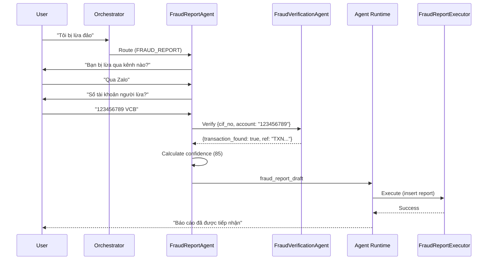

# FraudReportAgent

> Domain Agent responsible for receiving, verifying, and processing fraud reports from users.

---

## 1. Responsibility

FraudReportAgent handles the complete fraud reporting workflow: from initial report intake through multi-turn information gathering to building a verified fraud report draft.

| Does | Does NOT |
|------|----------|
| Parse fraud report info (LLM extract) | Block accounts directly |
| Delegate to FraudVerificationAgent | Execute side effects |
| Conduct multi-turn interview (gather fraud context) | Override Guardian |
| Calculate confidence score (rule-based) | Make final fraud determination |
| Build fraud_report_draft | Update reported_accounts directly |
| Guide user through evidence collection | Approve its own actions |

---

## 2. Pipeline

```text
┌─────────────────────────────────────────────────────────┐
│ 1. RECEIVE ROUTED REQUEST                               │
│    Input: user_message (e.g., "Tôi bị lừa đảo")       │
│    Source: Orchestrator (task_type = FRAUD_REPORT)       │
└────────────────────────────┬────────────────────────────┘
                             │
                             ▼
┌─────────────────────────────────────────────────────────┐
│ 2. INITIAL EXTRACTION (LLM call)                        │
│    Extract what's available from first message:         │
│    • fraud_type (if detectable)                         │
│    • reported_account_no (if mentioned)                 │
│    • transaction_ref (if mentioned)                     │
│    • contact_channel (if mentioned)                     │
│    • reason_text (description)                          │
│    Identify what's MISSING for a complete report        │
└────────────────────────────┬────────────────────────────┘
                             │
                             ▼
┌─────────────────────────────────────────────────────────┐
│ 3. MULTI-TURN INFORMATION GATHERING                     │
│    Ask structured questions to collect:                  │
│    Q1: "Bạn bị lừa qua kênh nào?" (contact_channel)   │
│    Q2: "Số tài khoản người lừa đảo?" (account_no)     │
│    Q3: "Ngân hàng nào?" (bank_code)                    │
│    Q4: "Giao dịch nào liên quan?" (transaction_ref)    │
│    Q5: "Hậu quả hiện tại?" (aftermath)                 │
│    Q6: "Bạn có bằng chứng?" (has_evidence)             │
│    → Each question only asked if field is missing       │
│    → Skip questions already answered in initial message │
└────────────────────────────┬────────────────────────────┘
                             │
                             ▼
┌─────────────────────────────────────────────────────────┐
│ 4. VERIFICATION (delegate to FraudVerificationAgent)    │
│    • Verify user actually has a transaction to the      │
│      reported account (via TransactionHistory lookup)   │
│    • Check if reported_account_no already exists in     │
│      reported_accounts table                            │
│    • Return verification evidence                       │
└────────────────────────────┬────────────────────────────┘
                             │
                             ▼
┌─────────────────────────────────────────────────────────┐
│ 5. CONFIDENCE SCORING (rule-based, not LLM)             │
│    Score = base_score                                   │
│      + has_evidence_bonus (+20)                         │
│      + verified_transaction_bonus (+15)                 │
│      + existing_reports_bonus (+10 per existing report) │
│      + detailed_description_bonus (+10)                 │
│      - no_transaction_penalty (-20)                     │
│    Clamp to [30, 100]                                   │
└────────────────────────────┬────────────────────────────┘
                             │
                             ▼
┌─────────────────────────────────────────────────────────┐
│ 6. BUILD FRAUD REPORT DRAFT                             │
│    {                                                    │
│      reporter_cif_no, transaction_ref,                  │
│      reported_account_no, reported_bank_code,           │
│      fraud_type, contact_channel, aftermath,            │
│      reason_text, has_evidence, confidence_score,       │
│      status: "SUBMITTED"                                │
│    }                                                    │
└────────────────────────────┬────────────────────────────┘
                             │
                             ▼
┌─────────────────────────────────────────────────────────┐
│ 7. RETURN TO AGENT RUNTIME                              │
│    → Guardian validates (low risk, typically GREEN)     │
│    → FraudReportExecutor inserts into fraud_reports     │
│    → Updates reported_accounts aggregate                │
│    → Updates reported_customers if applicable           │
│    → Audit log records full trace                       │
└─────────────────────────────────────────────────────────┘
```

---

## 3. Multi-Turn Interview Flow

```text
Turn 1: User says "Tôi bị lừa chuyển tiền qua Zalo"
  → Extract: fraud_type=SCAM_TRANSFER, contact_channel=ZALO
  → Missing: reported_account_no, bank_code, transaction_ref, aftermath, evidence

Turn 2: Agent asks "Số tài khoản người lừa đảo là gì? Ngân hàng nào?"
  → User: "Tài khoản 123456789 ngân hàng VCB"
  → Extract: reported_account_no=123456789, bank_code=VCB

Turn 3: Agent asks "Bạn có mã giao dịch không? (có thể xem trong lịch sử)"
  → User: "Không nhớ, chuyển hôm qua 5 triệu"
  → Delegate to FraudVerificationAgent to find matching transaction

Turn 4: Agent asks "Hiện tại tình trạng thế nào? (mất tiền, bị block, ...)"
  → User: "Mất tiền rồi, đối phương block Zalo"
  → Extract: aftermath=BLOCKED_CONTACT

Turn 5: Agent asks "Bạn có screenshot hoặc bằng chứng nào không?"
  → User: "Có screenshot chat"
  → Extract: has_evidence=true

Turn 6: Agent confirms and submits report
```

---

## 4. Confidence Scoring Rules

| Factor | Points | Condition |
|--------|--------|-----------|
| Base score | 50 | Always |
| Has evidence | +20 | has_evidence = true |
| Verified transaction exists | +15 | FraudVerificationAgent confirms txn |
| Existing reports for same account | +10 each | reported_accounts already has records |
| Detailed description (>50 chars) | +10 | reason_text length > 50 |
| No matching transaction found | -20 | Cannot verify any txn to reported account |
| Vague description (<20 chars) | -10 | reason_text length < 20 |

**Score ranges:**
- 80-100: High confidence → status = VALIDATED
- 50-79: Medium confidence → status = SUBMITTED (needs manual review)
- 30-49: Low confidence → status = SUBMITTED (flagged for review)

---

## 5. Fraud Report Draft Schema

```json
{
  "action_type": "FRAUD_REPORT",
  "cif_no": "CIF000032",
  "api_name": "fraud_report_service",
  "report_draft": {
    "reporter_cif_no": "CIF000032",
    "transaction_ref": "TXN202605003200",
    "reported_account_no": "8812520566",
    "reported_bank_code": "VPB",
    "reported_customer_cif": null,
    "fraud_type": "LOAN_SCAM",
    "contact_channel": "ZALO",
    "aftermath": "BLOCKED_CONTACT",
    "reason_text": "Bi lua dao qua zalo, hua cho vay lai suat thap, yeu cau chuyen phi truoc 5 trieu",
    "has_evidence": true,
    "confidence_score": 85,
    "status": "VALIDATED"
  },
  "verification_evidence": {
    "transaction_found": true,
    "transaction_ref": "TXN202605003200",
    "transaction_amount": 5000000,
    "existing_reports_count": 1
  }
}
```

---

## 6. Interactions with Other Components

```text
FraudReportAgent
  ├── delegates to → FraudVerificationAgent
  │     • Verify user has transaction to reported account
  │     • Check reported_accounts for existing reports
  │     • Returns: { transaction_found, existing_reports_count }
  │
  ├── delegates to → TransactionHistoryAgent (via FraudVerification)
  │     • Search past transactions matching criteria
  │     • Returns: matching transaction_ref
  │
  ├── returns draft to → Agent Runtime
  │     • Agent Runtime → Guardian (validate)
  │     • Guardian → FrictionRouter (typically GREEN for reports)
  │     • FraudReportExecutor inserts report
  │
  └── post-execution effects:
        • fraud_reports: new row inserted
        • reported_accounts: valid_report_count++, risk recalculated
        • reported_customers: updated if linked_customer_cif known
```

---

## 7. Edge Cases

| Scenario | Handling |
|----------|----------|
| User cannot provide account number | Ask if they can check transaction history; offer to search |
| Reported account already CRITICAL in system | Inform user, still accept report (adds to evidence) |
| User reports their own account | Reject: reporter_cif cannot own reported_account |
| No transaction found to reported account | Accept report with lower confidence, flag for review |
| User wants to check fraud report status | Route to CHECK_FRAUD_STATUS operation |
| Duplicate report (same user, same account) | Warn user, ask if new incident or update |

---

## 8. Sequence Diagram


