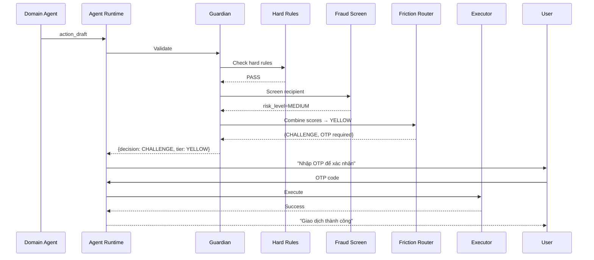

# Guardian

> Central safety layer responsible for validating all agent actions before execution.

---

## 1. Responsibility

Guardian is the mandatory checkpoint between domain agents (who build drafts) and executors (who call APIs). Every action draft passes through Guardian — no exceptions.

| Does | Does NOT |
|------|----------|
| Apply hard rules (deterministic) | Generate action drafts |
| Compute model-based risk scores | Call banking APIs |
| Screen transactions against fraud DB | Handle user conversations |
| Route friction (OTP, confirmation, block) | Make business decisions |
| Log all decisions to audit trail | Override user explicit consent |
| Enforce rate limits and velocity checks | Approve itself |

---

## 2. Pipeline

```text
┌─────────────────────────────────────────────────────────┐
│ 1. RECEIVE ACTION DRAFT                                 │
│    From: Agent Runtime (after domain agent completes)    │
│    Input: { action_type, cif_no, api_payload, ... }     │
└────────────────────────────┬────────────────────────────┘
                             │
                             ▼
┌─────────────────────────────────────────────────────────┐
│ 2. HARD RULES ENGINE (deterministic, no LLM)            │
│    Check against immutable rules:                       │
│    • Daily limit: total_today + amount ≤ daily_max      │
│    • Single txn limit: amount ≤ single_max              │
│    • Self-transfer block: from_acc ≠ to_acc owner       │
│    • Currency match: amount_currency == account_currency │
│    • Account status: must be ACTIVE                     │
│    → FAIL: immediate BLOCK (no override possible)       │
│    → PASS: continue to next layer                       │
└────────────────────────────┬────────────────────────────┘
                             │
                             ▼
┌─────────────────────────────────────────────────────────┐
│ 3. TRANSACTION SCREENING                                │
│    Check reported_accounts + reported_customers:         │
│    • Is recipient in reported_accounts?                  │
│    • What is recipient's risk_level?                     │
│    • What is valid_report_count?                         │
│    Risk assessment:                                      │
│    • CRITICAL → BLOCK (auto-decline)                    │
│    • HIGH → ORANGE (manager approval required)          │
│    • MEDIUM → YELLOW (OTP + warning)                    │
│    • LOW / NOT_FOUND → continue                         │
│    → BLOCK or UPGRADE friction level                    │
└────────────────────────────┬────────────────────────────┘
                             │
                             ▼
┌─────────────────────────────────────────────────────────┐
│ 4. VELOCITY & ANOMALY CHECKS                            │
│    • Transaction count in last 1h, 24h                  │
│    • Amount vs user's typical behavior (std dev)        │
│    • Unusual time (2am-5am)                             │
│    • New recipient + large amount combo                 │
│    → Score: velocity_risk (0-100)                       │
└────────────────────────────┬────────────────────────────┘
                             │
                             ▼
┌─────────────────────────────────────────────────────────┐
│ 5. MODEL-BASED RISK SCORING (optional, for production)  │
│    • Input features: amount, time, recipient_history,   │
│      user_pattern, device_info                          │
│    • Output: risk_score (0-100)                         │
│    • Hackathon: simplified rule-based scoring           │
│    • Production: ML model inference                     │
└────────────────────────────┬────────────────────────────┘
                             │
                             ▼
┌─────────────────────────────────────────────────────────┐
│ 6. FRICTION ROUTER                                      │
│    Combine all signals into final decision:             │
│    final_risk = max(fraud_screening, velocity, model)   │
│    Map to friction tier:                                │
│    • GREEN (0-25): Auto-approve, no extra verification  │
│    • YELLOW (26-50): OTP + confirmation message         │
│    • ORANGE (51-75): OTP + cooling period + warning     │
│    • RED (76-100): BLOCK, escalate to human             │
└────────────────────────────┬────────────────────────────┘
                             │
                             ▼
┌─────────────────────────────────────────────────────────┐
│ 7. RETURN DECISION                                      │
│    {                                                    │
│      decision: ALLOW | CHALLENGE | BLOCK,               │
│      friction_tier: GREEN | YELLOW | ORANGE | RED,      │
│      required_actions: [OTP, CONFIRM, COOLDOWN],        │
│      risk_breakdown: {...},                              │
│      reason: "..."                                      │
│    }                                                    │
└─────────────────────────────────────────────────────────┘
```

---

## 3. Hard Rules Engine

These rules are **immutable** — they cannot be overridden by the user, LLM, or any agent.

| Rule | Condition | Action |
|------|-----------|--------|
| Daily limit exceeded | sum_today + amount > daily_max | BLOCK |
| Single transaction max | amount > single_transaction_max | BLOCK |
| Self-transfer loop | from_account.owner == to_account.owner (same bank) | WARN (allow) |
| Inactive account | account.status ≠ ACTIVE | BLOCK |
| Expired card | card.expiry_date < today | BLOCK |
| Currency mismatch | payload.currency ≠ account.currency | BLOCK |
| Negative amount | amount ≤ 0 | BLOCK |

---

## 4. Fraud Screening Detail

```text
Input: recipient_account_no, recipient_bank_code

Step 1: Query reported_accounts
  SELECT risk_level, valid_report_count, last_reported_at
  FROM reported_accounts
  WHERE account_no = :recipient AND bank_code = :bank

Step 2: Decision matrix

  ┌────────────────┬──────────────┬───────────────────────────┐
  │ risk_level     │ Friction     │ User message              │
  ├────────────────┼──────────────┼───────────────────────────┤
  │ CRITICAL       │ RED (BLOCK)  │ "TK đã bị báo cáo lừa    │
  │                │              │  đảo nhiều lần, giao dịch  │
  │                │              │  bị chặn"                  │
  ├────────────────┼──────────────┼───────────────────────────┤
  │ HIGH           │ ORANGE       │ "TK có nhiều báo cáo lừa  │
  │                │              │  đảo. Xác nhận tiếp tục?" │
  ├────────────────┼──────────────┼───────────────────────────┤
  │ MEDIUM         │ YELLOW       │ "TK đã từng bị báo cáo.   │
  │                │              │  Bạn có chắc không?"       │
  ├────────────────┼──────────────┼───────────────────────────┤
  │ LOW            │ GREEN        │ No warning                │
  ├────────────────┼──────────────┼───────────────────────────┤
  │ NOT_FOUND      │ GREEN        │ No warning                │
  └────────────────┴──────────────┴───────────────────────────┘
```

---

## 5. Friction Tiers

| Tier | Risk Score | Actions Required | UX |
|------|-----------|------------------|-----|
| GREEN | 0-25 | None (auto-approve) | Confirm button only |
| YELLOW | 26-50 | OTP verification | "Nhập OTP để xác nhận" |
| ORANGE | 51-75 | OTP + 30s cooldown + warning | "Cảnh báo: ... Nhập OTP sau 30s" |
| RED | 76-100 | BLOCK (no override via chat) | "Giao dịch bị chặn. Liên hệ hotline" |

**Tier escalation rules:**
- Fraud screening can only UPGRADE tier (never downgrade)
- If hard rules fail → RED (bypasses scoring entirely)
- Multiple YELLOW signals → escalate to ORANGE

---

## 6. Decision Output Schema

```json
{
  "decision": "CHALLENGE",
  "friction_tier": "YELLOW",
  "risk_score": 42,
  "risk_breakdown": {
    "hard_rules": "PASS",
    "fraud_screening": "LOW",
    "velocity_risk": 15,
    "anomaly_score": 42,
    "model_score": null
  },
  "required_actions": ["OTP"],
  "reason": "Amount 50M exceeds typical transfer (avg 5M). New recipient.",
  "warnings": [
    "Số tiền giao dịch lớn hơn bình thường"
  ],
  "audit_ref": "GRD-20260501-001234"
}
```

---

## 7. Edge Cases

| Scenario | Handling |
|----------|----------|
| Guardian service timeout | BLOCK by default (fail-closed) |
| Recipient not in fraud DB but looks suspicious | Use velocity+anomaly only |
| User has high daily limit but unusual amount | Still triggers YELLOW+ via anomaly |
| Card lock (urgent safety) | GREEN — safety actions get lower friction |
| Fraud report submission | GREEN — report intake is low-risk |
| Multiple concurrent transfers | Velocity check catches burst pattern |
| System user (batch process) | Different rule set (system limits apply) |

---

## 8. Architecture Position

```text
┌──────────────────────────────────────────────────┐
│                 AGENT RUNTIME                      │
│                                                    │
│  Domain Agent → action_draft → ┌────────────┐    │
│                                │  GUARDIAN   │    │
│                                │             │    │
│                                │ Hard Rules  │    │
│                                │     ↓       │    │
│                                │ Fraud Screen│    │
│                                │     ↓       │    │
│                                │ Velocity    │    │
│                                │     ↓       │    │
│                                │ ML Score    │    │
│                                │     ↓       │    │
│                                │ Friction    │    │
│                                │ Router      │    │
│                                └──────┬─────┘    │
│                                       │           │
│                 ┌─────────────────────┼──────┐   │
│                 │ GREEN    YELLOW   ORANGE RED│   │
│                 │  ↓         ↓        ↓     ↓ │   │
│                 │ Execute  OTP+Exec  Cool  Block│  │
│                 └────────────────────────────┘   │
└──────────────────────────────────────────────────┘
```

---

## 9. Sequence Diagram


