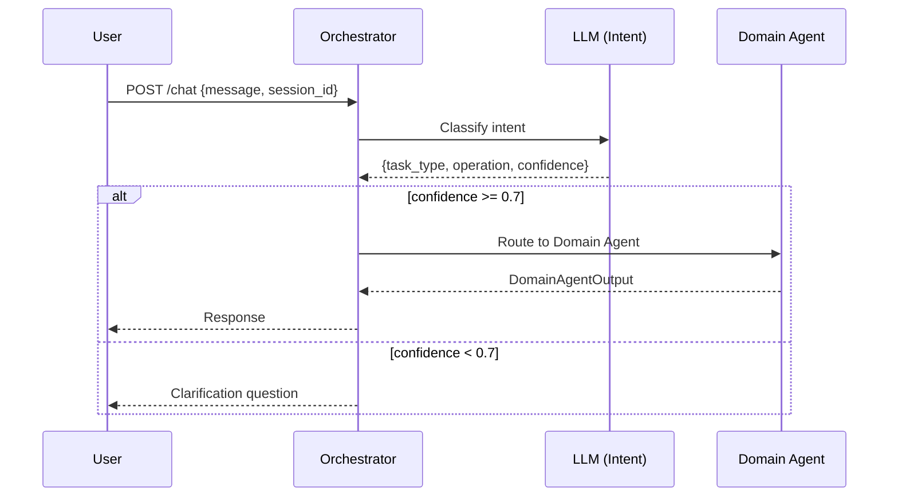

# Orchestrator

> The single entry point that classifies user intent and routes to the correct Domain Agent.

---

## 1. Responsibility

The Orchestrator is a **thin routing layer**. It performs exactly one LLM call to classify intent, then delegates everything to the appropriate Domain Agent.

| Does | Does NOT |
|------|----------|
| Classify intent (1 LLM call) | Extract entities from message |
| Route to Domain Agent by `task_type` | Resolve business details |
| Return Domain Agent response to caller | Make risk decisions |
| Handle unknown intent gracefully | Call sub-agents directly |
| Maintain conversation session | Execute any side effects |

---

## 2. Pipeline

```text
┌─────────────────────────────────────────────────────────┐
│ 1. RECEIVE REQUEST                                      │
│    Input: { message, session_id, cif_no }               │
└────────────────────────────┬────────────────────────────┘
                             │
                             ▼
┌─────────────────────────────────────────────────────────┐
│ 2. INTENT CLASSIFICATION (1 LLM call)                   │
│    Prompt: INTENT_SYSTEM_PROMPT + user message          │
│    Output: { task_type, operation, confidence, reason }  │
└────────────────────────────┬────────────────────────────┘
                             │
                             ▼
┌─────────────────────────────────────────────────────────┐
│ 3. CONFIDENCE CHECK                                     │
│    If confidence < 0.7 → ask clarification              │
│    If confidence >= 0.7 → proceed to routing            │
└────────────────────────────┬────────────────────────────┘
                             │
                             ▼
┌─────────────────────────────────────────────────────────┐
│ 4. ROUTE TO DOMAIN AGENT                                │
│    task_type → Agent mapping:                           │
│    • TRANSACTION      → TransactionAgent                │
│    • CARD_OPERATION   → CardAgent                       │
│    • DATA_QUERY       → DataQueryAgent                  │
│    • QA               → QAAgent                         │
│    • FRAUD_REPORT     → FraudReportAgent                │
│    • ACCOUNT_OPERATION→ AccountAgent                    │
│    • LOAN_OPERATION   → LoanAgent                       │
└────────────────────────────┬────────────────────────────┘
                             │
                             ▼
┌─────────────────────────────────────────────────────────┐
│ 5. RETURN RESPONSE                                      │
│    Pass Domain Agent output back to user                │
│    Include: response_text, action_draft (if any),       │
│             risk_tier, audit_trace                       │
└─────────────────────────────────────────────────────────┘
```

---

## 3. Intent Classification Schema

### Input

```json
{
  "message": "Chuyển cho Minh 2 triệu",
  "session_id": "sess_abc123",
  "cif_no": "CIF000001"
}
```

### LLM Output

```json
{
  "task_type": "TRANSACTION",
  "operation": "TRANSFER_MONEY",
  "confidence": 0.98,
  "reason": "User wants to initiate a money transfer."
}
```

---

## 4. Routing Table

| task_type | Domain Agent | Operations |
|-----------|-------------|------------|
| QA | QAAgent | policy questions, fees, rates, products |
| DATA_QUERY | DataQueryAgent | balance, spending, history, analysis |
| TRANSACTION | TransactionAgent | TRANSFER_MONEY, BILL_PAYMENT, TOP_UP |
| CARD_OPERATION | CardAgent | LOCK_CARD, UNLOCK_CARD, CHANGE_CARD_LIMIT, ... |
| ACCOUNT_OPERATION | AccountAgent | OPEN_ACCOUNT, CLOSE_ACCOUNT, MANAGE_BENEFICIARY, ... |
| LOAN_OPERATION | LoanAgent | APPLY_LOAN, REPAY_LOAN, CHECK_LOAN_STATUS, ... |
| FRAUD_REPORT | FraudReportAgent | REPORT_FRAUD, CHECK_FRAUD_STATUS |

---

## 5. Edge Cases

| Scenario | Handling |
|----------|----------|
| Low confidence (< 0.7) | Return clarification question to user |
| Multiple intents detected | Priority: FRAUD_REPORT > TRANSACTION > CARD > ACCOUNT > LOAN > DATA_QUERY > QA |
| Unknown intent | Fallback to QAAgent with general response |
| Prompt injection attempt | Intent classifier treats it as QA, Guardian blocks if needed |
| Empty message | Return generic greeting/help message |

---

## 6. Sequence Diagram


