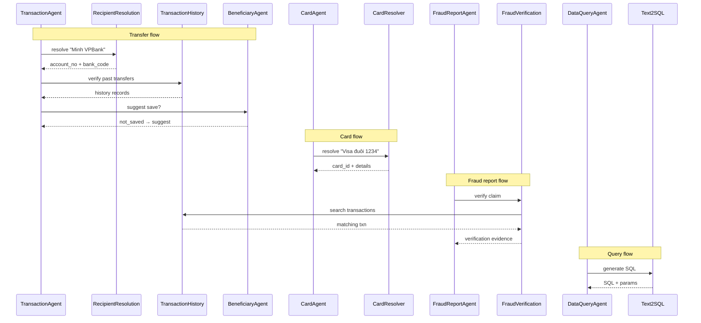

# Sub-Agents

> Specialized task-oriented agents invoked by domain agents to handle specific sub-tasks.

---

## Overview

Sub-agents are lightweight, focused agents that handle a single responsibility. They are never invoked directly by the Orchestrator — always delegated by a domain agent.

```text
Domain Agents (invoke sub-agents)
├── TransactionAgent → RecipientResolutionAgent
│                    → TransactionHistoryAgent
│                    → BeneficiaryAgent
├── CardAgent → CardResolverAgent
├── FraudReportAgent → FraudVerificationAgent
├── DataQueryAgent → Text2SQLAgent
│                  → PolicyRetrieverAgent
└── All Agents → PolicyRetrieverAgent (for rule lookups)
```

---

## 1. RecipientResolutionAgent

**Parent:** TransactionAgent  
**Purpose:** Resolve ambiguous recipient references to a concrete account number.

### Input

```json
{
  "task_type": "resolve_recipient",
  "constraints": {
    "cif_no": "CIF000001",
    "recipient_hint": "Minh VPBank",
    "amount": 5000000
  }
}
```

### Resolution Strategies

| Priority | Strategy | Condition |
|----------|----------|-----------|
| 1 | Exact match in beneficiaries | hint matches nickname or name |
| 2 | Fuzzy match in beneficiaries | Levenshtein distance ≤ 2 |
| 3 | Search transaction history | Find past transfers with similar counterparty |
| 4 | Ask user | Multiple candidates or no match |

### Output

```json
{
  "status": "RESOLVED",
  "recipient": {
    "account_no": "8812520566",
    "bank_code": "VPB",
    "account_name": "NGUYEN VAN MINH",
    "source": "beneficiaries"
  },
  "confidence": 0.95,
  "alternatives": []
}
```

### Edge Cases
- Multiple matches → return top 3 candidates for user to choose
- No match → inform user, ask for account number directly
- Partial info (name without bank) → filter beneficiaries by name, present options

---

## 2. TransactionHistoryAgent

**Parent:** TransactionAgent, FraudVerificationAgent  
**Purpose:** Search and filter user's transaction history.

### Input

```json
{
  "task_type": "search_transactions",
  "constraints": {
    "cif_no": "CIF000001",
    "counterparty_account": "8812520566",
    "time_range": "last_7_days",
    "direction": "OUT",
    "amount_range": [4000000, 6000000]
  }
}
```

### Capabilities
- Filter by: time range, amount range, counterparty, direction, category
- Sort by: date (default), amount
- Aggregation: sum, count, average over period
- Return: max 20 transactions per request

### Output

```json
{
  "status": "FOUND",
  "count": 2,
  "transactions": [
    {
      "transaction_ref": "TXN202605003200",
      "amount": 5000000,
      "direction": "OUT",
      "counterparty_name": "NGUYEN VAN MINH",
      "counterparty_account": "8812520566",
      "timestamp": "2026-05-14T10:30:00Z"
    }
  ]
}
```

---

## 3. BeneficiaryAgent

**Parent:** TransactionAgent  
**Purpose:** Manage saved beneficiaries (lookup, suggest save).

### Capabilities
- Lookup beneficiary by name, bank, or account number
- After successful transfer to new recipient → suggest saving as beneficiary
- Check if recipient already saved (avoid duplicates)

### Input/Output

```json
// Lookup
{"task_type": "lookup_beneficiary", "cif_no": "CIF000001", "query": "Minh VPB"}
// → {"found": true, "beneficiary": {...}}

// Suggest save
{"task_type": "suggest_save", "recipient": {"account_no": "...", "name": "...", "bank": "..."}}
// → Domain agent asks user: "Bạn có muốn lưu người nhận này không?"
```

---

## 4. CardResolverAgent

**Parent:** CardAgent  
**Purpose:** Resolve which card the user is referring to.

### Input

```json
{
  "task_type": "resolve_card",
  "constraints": {
    "cif_no": "CIF000001",
    "card_type": "CREDIT",
    "card_network": "VISA",
    "last4": "1234"
  }
}
```

### Resolution Logic

```text
1. Fetch all user's cards
2. Apply filters (type, network, last4)
3. If 1 result → return it
4. If 0 results → try relaxed search (drop one filter at a time)
5. If multiple → return candidates with details for user to pick
6. If user has only 1 card total → use it regardless of filters
```

### Output

```json
{
  "status": "RESOLVED",
  "card": {
    "card_id": "uuid-card-001",
    "masked_card_no": "**** **** **** 1234",
    "card_type": "CREDIT",
    "card_network": "VISA",
    "status": "ACTIVE",
    "credit_limit": 50000000
  }
}
```

---

## 5. FraudVerificationAgent

**Parent:** FraudReportAgent  
**Purpose:** Verify fraud report claims by cross-referencing transaction data and fraud database.

### Input

```json
{
  "task_type": "verify_fraud_report",
  "constraints": {
    "reporter_cif_no": "CIF000032",
    "reported_account_no": "8812520566",
    "reported_bank_code": "VPB",
    "claimed_amount": 5000000,
    "claimed_timeframe": "yesterday"
  }
}
```

### Verification Steps

| Step | Action | Result |
|------|--------|--------|
| 1 | Search reporter's transactions to reported_account | transaction_found (bool) |
| 2 | Check reported_accounts table | existing_reports_count |
| 3 | Check reported_customers table | linked_customer_risk |
| 4 | Cross-reference amount and time | amount_matches (bool) |

### Output

```json
{
  "status": "VERIFIED",
  "evidence": {
    "transaction_found": true,
    "transaction_ref": "TXN202605003200",
    "transaction_amount": 5000000,
    "transaction_time": "2026-05-14T10:30:00Z",
    "existing_reports_count": 1,
    "reported_account_risk": "MEDIUM",
    "amount_matches": true
  }
}
```

---

## 6. Text2SQLAgent

**Parent:** DataQueryAgent  
**Purpose:** Generate safe, scoped SQL from natural language questions.

### Input

```json
{
  "task_type": "generate_sql",
  "constraints": {
    "user_question": "Tháng này tôi tiêu bao nhiêu cho ăn uống?",
    "cif_no": "CIF000001",
    "schema_context": ["transactions", "transaction_categories"],
    "time_context": "2026-05"
  }
}
```

### SQL Generation Rules
1. Always use parameterized queries (`:user_id`, `:start_date`, etc.)
2. Always include `WHERE cif_no = :user_id`
3. Always add `LIMIT` (max 100)
4. Only SELECT statements
5. Only allowed tables (see DataQueryAgent allowlist)
6. JOINs allowed only between allowed tables

### Output

```json
{
  "status": "GENERATED",
  "sql": "SELECT SUM(t.amount) as total, COUNT(*) as count FROM transactions t JOIN transaction_categories tc ON t.category_id = tc.id WHERE t.cif_no = :user_id AND tc.name = 'FOOD' AND t.transaction_date >= :start_date AND t.transaction_date <= :end_date AND t.direction = 'OUT' LIMIT 1",
  "params": {
    "user_id": "CIF000001",
    "start_date": "2026-05-01",
    "end_date": "2026-05-31"
  },
  "tables_used": ["transactions", "transaction_categories"]
}
```

---

## 7. PolicyRetrieverAgent

**Parent:** Any domain agent  
**Purpose:** Retrieve bank policy rules relevant to the current operation.

### Input

```json
{
  "task_type": "retrieve_policy",
  "constraints": {
    "operation": "TRANSFER",
    "amount": 50000000,
    "account_type": "SAVINGS"
  }
}
```

### Policy Types
- Transfer limits (daily, per-transaction, by account type)
- Card policies (max limit, lock/unlock rules)
- Fraud thresholds (when to escalate)
- Time-based restrictions (night transfers, holiday rules)
- KYC requirements (large amount verification)

### Output

```json
{
  "status": "FOUND",
  "policies": [
    {
      "rule_id": "TRF-001",
      "description": "Single transfer max for savings: 500M VND",
      "limit": 500000000,
      "applies_to": "SAVINGS",
      "action": "BLOCK if exceeded"
    },
    {
      "rule_id": "TRF-002",
      "description": "Transfers > 50M require OTP",
      "threshold": 50000000,
      "action": "OTP required"
    }
  ]
}
```

---

## 8. Summary Comparison

| Sub-Agent | Parent(s) | I/O Type | Stateful? | LLM Used? |
|-----------|-----------|----------|-----------|-----------|
| RecipientResolutionAgent | TransactionAgent | DB lookup + LLM fuzzy | No | Yes (fuzzy match) |
| TransactionHistoryAgent | TransactionAgent, FraudVerification | DB query | No | No |
| BeneficiaryAgent | TransactionAgent | DB lookup | No | No |
| CardResolverAgent | CardAgent | DB query + filter | No | No |
| FraudVerificationAgent | FraudReportAgent | Multi-DB query | No | No |
| Text2SQLAgent | DataQueryAgent | LLM generation | No | Yes (SQL gen) |
| PolicyRetrieverAgent | Any | Config/DB lookup | No | No |

---

## 9. Sequence Diagram (Composite)


