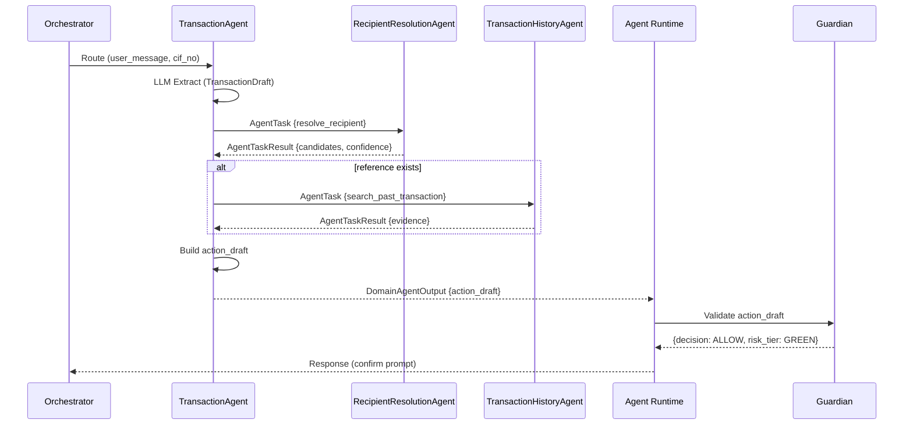

# TransactionAgent

> Domain Agent responsible for money movement: transfers, bill payments, and top-ups.

---

## 1. Responsibility

TransactionAgent owns the complete workflow from parsing a user's transaction request to building a fully-resolved action draft ready for Guardian validation.

| Does | Does NOT |
|------|----------|
| Parse user message (LLM extract structured fields) | Execute the transaction |
| Detect missing fields | Call banking APIs |
| Plan resolution strategy | Bypass Guardian |
| Delegate to sub-agents for context resolution | Approve its own risk |
| Collect evidence-backed outputs | Override Guardian decision |
| Build and return action_draft | Auto-fill high-risk fields without evidence |

---

## 2. Pipeline

```text
┌─────────────────────────────────────────────────────────┐
│ 1. RECEIVE ROUTED REQUEST                               │
│    Input: user_message + session context + cif_no       │
│    Source: Orchestrator (task_type = TRANSACTION)        │
└────────────────────────────┬────────────────────────────┘
                             │
                             ▼
┌─────────────────────────────────────────────────────────┐
│ 2. TRANSACTION EXTRACTION (LLM call)                    │
│    Prompt: TRANSACTION_SYSTEM_PROMPT + user message     │
│    Output: TransactionDraft {                           │
│      action, amount, recipient_hint,                    │
│      recipient_account, recipient_bank,                 │
│      reference_context, missing_fields, ...             │
│    }                                                    │
└────────────────────────────┬────────────────────────────┘
                             │
                             ▼
┌─────────────────────────────────────────────────────────┐
│ 3. RESOLUTION PLANNING                                  │
│    Check missing_fields and resolvable_fields:          │
│    • recipient_account missing + hint exists            │
│      → plan: call RecipientResolutionAgent              │
│    • reference to past transaction                      │
│      → plan: call TransactionHistoryAgent               │
│    • bill provider but no customer_code                 │
│      → plan: call BillerResolutionAgent                 │
│    • Multiple resolutions needed → sequential calls     │
└────────────────────────────┬────────────────────────────┘
                             │
                             ▼
┌─────────────────────────────────────────────────────────┐
│ 4. DELEGATE TO SUB-AGENTS                               │
│    Send structured AgentTask to each sub-agent:         │
│    • RecipientResolutionAgent                           │
│    • TransactionHistoryAgent                            │
│    • BillerResolutionAgent                              │
│    Receive AgentTaskResult with candidates + evidence   │
└────────────────────────────┬────────────────────────────┘
                             │
                             ▼
┌─────────────────────────────────────────────────────────┐
│ 5. CANDIDATE EVALUATION                                 │
│    • Single candidate with high confidence → use it     │
│    • Multiple candidates → ask user to disambiguate     │
│    • No candidates → ask user for explicit info         │
│    • Low confidence → ask user confirmation             │
└────────────────────────────┬────────────────────────────┘
                             │
                             ▼
┌─────────────────────────────────────────────────────────┐
│ 6. BUILD ACTION DRAFT                                   │
│    Assemble complete action_draft:                      │
│    {                                                    │
│      action_type: "TRANSFER",                           │
│      cif_no, from_account, to_account, to_bank,        │
│      to_name, amount, currency, description,            │
│      evidence: [...], confidence, source_agent          │
│    }                                                    │
└────────────────────────────┬────────────────────────────┘
                             │
                             ▼
┌─────────────────────────────────────────────────────────┐
│ 7. RETURN TO AGENT RUNTIME                              │
│    → Agent Runtime sends draft to Guardian              │
│    → Guardian validates → risk tier                     │
│    → Friction/Auth gate                                 │
│    → Executor performs side effect                      │
└─────────────────────────────────────────────────────────┘
```

---

## 3. Supported Actions

| Action | Description | Required Fields |
|--------|-------------|-----------------|
| TRANSFER_MONEY | Bank transfer to person/account | amount, to_account, to_bank, to_name |
| BILL_PAYMENT | Pay utility bills | bill_provider, customer_code, amount |
| TOP_UP | Phone/wallet top-up | amount, topup_target (phone/wallet) |

---

## 4. Resolution Strategy

### 4.1 Recipient Resolution

**Trigger:** `recipient_hint` present but `recipient_account` missing.

```text
TransactionAgent
  → RecipientResolutionAgent {
      task_type: "resolve_recipient",
      constraints: { cif_no, recipient_name: "Minh" }
    }
  ← AgentTaskResult {
      candidates: [
        { name: "Nguyen Van Minh", account: "123456789", bank: "VCB", source: "beneficiaries" },
        { name: "Tran Minh", account: "987654321", bank: "TCB", source: "beneficiaries" }
      ],
      confidence: 0.6  // ambiguous → ask user
    }
```

**Decision logic:**
- 1 candidate + confidence > 0.85 → auto-fill
- 1 candidate + confidence 0.7-0.85 → confirm with user
- Multiple candidates → present options to user
- 0 candidates → ask user for explicit account number

### 4.2 Historical Reference Resolution

**Trigger:** `reference_context.has_reference = true`

```text
TransactionAgent
  → TransactionHistoryAgent {
      task_type: "search_past_transaction",
      constraints: { cif_no, recipient_name: "Minh", time_range: "last_month" }
    }
  ← AgentTaskResult {
      candidates: [
        { transaction_ref: "TXN202604001234", to_account: "123456789",
          to_bank: "VCB", to_name: "Nguyen Van Minh", amount: 2000000 }
      ],
      evidence: ["TXN202604001234"],
      confidence: 0.92
    }
```

### 4.3 Biller Resolution

**Trigger:** `bill_provider` present but `customer_code` missing.

```text
TransactionAgent
  → BillerResolutionAgent {
      task_type: "resolve_biller",
      constraints: { cif_no, bill_type: "electricity" }
    }
  ← AgentTaskResult {
      candidates: [
        { biller_code: "EVN_HANOI", customer_bill_code: "PD123456789", alias: "Nhà Hà Nội" }
      ],
      confidence: 0.95
    }
```

---

## 5. Action Draft Schema

```json
{
  "action_type": "TRANSFER",
  "cif_no": "CIF000001",
  "api_name": "external_transfer_api",
  "api_payload": {
    "from_account_no": "92644220969",
    "to_account_no": "123456789",
    "to_bank_code": "VCB",
    "to_name": "Nguyen Van Minh",
    "amount": 2000000,
    "currency": "VND",
    "description": "Chuyen tien cho Minh"
  },
  "resolved_entities": {
    "recipient_name": "Nguyen Van Minh",
    "recipient_account": "123456789",
    "recipient_bank": "VCB",
    "amount": 2000000,
    "source_account": "92644220969"
  },
  "evidence": {
    "recipient_source": "beneficiaries",
    "recipient_confidence": 0.95,
    "history_match": "TXN202604001234"
  },
  "missing_fields": [],
  "risk_indicators": {
    "is_new_recipient": false,
    "amount_vs_average": 1.2,
    "unusual_time": false
  }
}
```

---

## 6. Edge Cases

| Scenario | Handling |
|----------|----------|
| Ambiguous recipient ("Minh" matches 2 people) | Return disambiguation question with options |
| Amount too vague ("vài triệu") | Return clarification: "Bạn muốn chuyển chính xác bao nhiêu?" |
| Multiple transactions in one message | Set `multi_transaction_detected = true`, ask user to send one at a time |
| Reference but no history match | Ask user for explicit recipient details |
| New recipient (not in beneficiaries) | Flag as `is_new_recipient: true` for Guardian risk scoring |
| Source account ambiguous (multiple accounts) | Use default PAYMENT account or ask user |

---

## 7. Sequence Diagram


