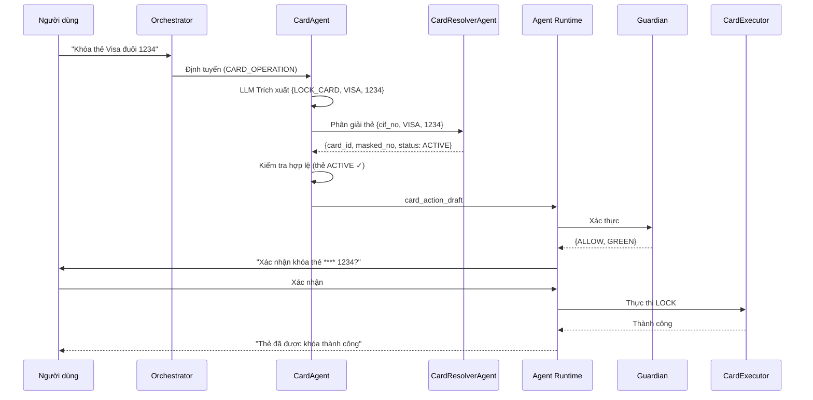

# CardAgent

> Domain Agent chịu trách nhiệm quản lý thẻ: khóa, mở khóa, thay đổi hạn mức, và truy vấn thông tin thẻ.

---

## 1. Trách Nhiệm

CardAgent xử lý tất cả các thao tác liên quan đến thẻ. Nó phân giải thẻ mục tiêu (đặc biệt khi người dùng có nhiều thẻ), xây dựng bản nháp thao tác, và trả về cho Guardian xác thực.

| Làm | KHÔNG làm |
|-----|-----------|
| Phân tích yêu cầu thao tác thẻ (LLM trích xuất) | Thực thi thao tác thẻ trực tiếp |
| Phân giải thẻ mục tiêu (ủy quyền CardResolverAgent) | Gọi API dịch vụ thẻ |
| Xử lý sự mơ hồ (nhiều thẻ) | Bỏ qua Guardian |
| Xây dựng card_action_draft | Tự phê duyệt rủi ro |
| Hỗ trợ workflow khóa/mở khóa/thay đổi hạn mức | Ghi đè quyết định Guardian |

---

## 2. Pipeline

```text
┌─────────────────────────────────────────────────────────┐
│ 1. NHẬN YÊU CẦU ĐÃ ĐỊNH TUYẾN                         │
│    Input: "Khóa thẻ tín dụng Visa đuôi 1234"          │
│    Nguồn: Orchestrator (task_type = CARD_OPERATION)     │
└────────────────────────────┬────────────────────────────┘
                             │
                             ▼
┌─────────────────────────────────────────────────────────┐
│ 2. TRÍCH XUẤT THAO TÁC (gọi LLM)                      │
│    Output: {                                            │
│      operation: "LOCK_CARD",                            │
│      card_hint: "tín dụng Visa đuôi 1234",             │
│      card_type_filter: "CREDIT",                        │
│      card_network_filter: "VISA",                       │
│      last4_filter: "1234",                              │
│      reason: "USER_REQUEST"                             │
│    }                                                    │
└────────────────────────────┬────────────────────────────┘
                             │
                             ▼
┌─────────────────────────────────────────────────────────┐
│ 3. PHÂN GIẢI THẺ (ủy quyền CardResolverAgent)         │
│    Truy vấn thẻ của người dùng với bộ lọc:            │
│    • card_type = CREDIT                                 │
│    • card_network = VISA                                │
│    • masked_card_no LIKE '%1234'                        │
│    → Khớp duy nhất → sử dụng                          │
│    → Nhiều kết quả → hỏi người dùng                   │
│    → Không khớp → thông báo người dùng                 │
└────────────────────────────┬────────────────────────────┘
                             │
                             ▼
┌─────────────────────────────────────────────────────────┐
│ 4. KIỂM TRA HỢP LỆ                                     │
│    • LOCK: thẻ phải ở trạng thái ACTIVE                │
│    • UNLOCK: thẻ phải ở trạng thái LOCKED              │
│    • LIMIT_CHANGE: thẻ phải là CREDIT + ACTIVE         │
│    • Hạn mức mới phải trong phạm vi chính sách        │
│    Nếu không hợp lệ → trả thông báo lỗi cho người dùng│
└────────────────────────────┬────────────────────────────┘
                             │
                             ▼
┌─────────────────────────────────────────────────────────┐
│ 5. XÂY DỰNG CARD ACTION DRAFT                          │
│    {                                                    │
│      action_type: "CARD_LOCK",                          │
│      card_id, masked_card_no, action, reason,           │
│      new_limit (nếu LIMIT_CHANGE)                      │
│    }                                                    │
└────────────────────────────┬────────────────────────────┘
                             │
                             ▼
┌─────────────────────────────────────────────────────────┐
│ 6. TRẢ VỀ CHO AGENT RUNTIME                            │
│    → Guardian xác thực                                  │
│    → Ma sát: LOCK thường GREEN (hành động an toàn khẩn) │
│    → LIMIT_CHANGE là YELLOW+ (ảnh hưởng tài chính)    │
│    → CardExecutor thực hiện thao tác                   │
└─────────────────────────────────────────────────────────┘
```

---

## 3. Các Thao Tác Hỗ Trợ

| Thao tác | Mô tả | Mức rủi ro | Trường bắt buộc |
|----------|--------|-----------|-----------------|
| LOCK_CARD | Đóng băng thẻ ngay lập tức | GREEN (hành động an toàn) | card_id, reason |
| UNLOCK_CARD | Kích hoạt lại thẻ đã khóa | YELLOW (xác minh danh tính) | card_id |
| CHANGE_CARD_LIMIT | Tăng/giảm hạn mức | YELLOW-ORANGE | card_id, new_limit |
| VIEW_CARD_INFO | Hiển thị chi tiết thẻ | N/A (chỉ đọc) | card_id hoặc cif_no |

---

## 4. Logic Phân Giải Thẻ

```text
CardResolverAgent nhận:
{
  task_type: "resolve_card",
  constraints: {
    cif_no: "CIF000001",
    card_type: "CREDIT",        // tùy chọn
    card_network: "VISA",       // tùy chọn
    last4: "1234"               // tùy chọn
  }
}

Thứ tự ưu tiên phân giải:
1. Nếu có last4 → khớp chính xác (thường duy nhất)
2. Nếu có card_type + network → lọc
3. Nếu chỉ 1 thẻ khớp → sử dụng
4. Nếu nhiều thẻ → trả danh sách cho người dùng chọn
5. Nếu người dùng chỉ có 1 thẻ tổng cộng → sử dụng bất kể hint
```

---

## 5. Schema Action Draft

### LOCK_CARD (Khóa thẻ)

```json
{
  "action_type": "CARD_LOCK",
  "cif_no": "CIF000001",
  "api_name": "external_card_service_api",
  "api_payload": {
    "card_id": "uuid-card-001",
    "masked_card_no": "**** **** **** 1234",
    "action": "LOCK",
    "reason": "USER_REQUEST"
  }
}
```

### CHANGE_CARD_LIMIT (Thay đổi hạn mức)

```json
{
  "action_type": "CARD_LIMIT_CHANGE",
  "cif_no": "CIF000001",
  "api_name": "external_card_service_api",
  "api_payload": {
    "card_id": "uuid-card-001",
    "masked_card_no": "**** **** **** 5678",
    "new_limit": 100000000,
    "currency": "VND"
  }
}
```

---

## 6. Xử Lý Biên (Edge Cases)

| Tình huống | Cách xử lý |
|------------|-------------|
| Người dùng nói "khóa thẻ" nhưng có 3 thẻ | Hỏi: "Bạn muốn khóa thẻ nào?" + liệt kê thẻ |
| Khóa thẻ đã bị khóa | Thông báo: "Thẻ này đã bị khóa trước đó" |
| Mở khóa nhưng thẻ đã EXPIRED | Thông báo: "Thẻ đã hết hạn, không thể mở khóa" |
| Thay đổi hạn mức trên thẻ DEBIT | Thông báo: "Thẻ ghi nợ không có hạn mức tín dụng" |
| Hạn mức mới vượt tối đa ngân hàng | Thông báo phạm vi hạn mức, yêu cầu điều chỉnh |
| Khóa khẩn cấp (nghi ngờ bị đánh cắp) | Fast-track: bỏ qua xác nhận, chuyển thẳng Guardian |

---

## 7. Sơ Đồ Tuần Tự


