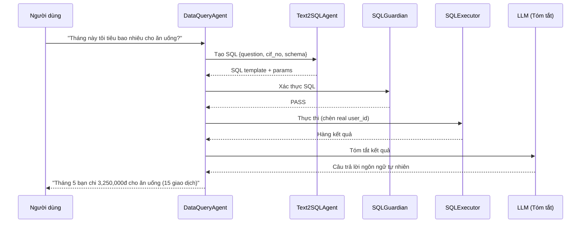

# DataQueryAgent

> Domain Agent chịu trách nhiệm trả lời câu hỏi của người dùng về dữ liệu ngân hàng bằng pipeline Text2SQL.

---

## 1. Trách Nhiệm

DataQueryAgent chuyển đổi câu hỏi ngôn ngữ tự nhiên thành truy vấn SQL, thực thi chúng an toàn qua pipeline Text2SQL, và trả về câu trả lời dễ đọc.

| Làm | KHÔNG làm |
|-----|-----------|
| Lập kế hoạch truy vấn chỉ-đọc | Thực thi thao tác ghi |
| Ủy quyền cho Text2SQLAgent tạo SQL | Truy cập dữ liệu người dùng khác |
| Chuyển SQL qua SQLGuardian để xác thực | Bỏ qua user_id scoping |
| Tóm tắt kết quả truy vấn bằng ngôn ngữ tự nhiên | Đưa ra quyết định giao dịch |
| Xử lý câu hỏi phân tích đa bước | Gọi API ngân hàng |

---

## 2. Pipeline

```text
┌─────────────────────────────────────────────────────────┐
│ 1. NHẬN YÊU CẦU ĐÃ ĐỊNH TUYẾN                         │
│    Input: "Tháng này tôi tiêu bao nhiêu cho ăn uống?" │
│    Context: cif_no = CIF000001                          │
└────────────────────────────┬────────────────────────────┘
                             │
                             ▼
┌─────────────────────────────────────────────────────────┐
│ 2. LẬP KẾ HOẠCH TRUY VẤN                               │
│    • Xác định loại truy vấn (tổng hợp, liệt kê, so sánh)│
│    • Xác định bảng mục tiêu (transactions, accounts...)│
│    • Xác định khoảng thời gian và bộ lọc              │
│    • Lập kế hoạch: truy vấn đơn hay đa bước?          │
└────────────────────────────┬────────────────────────────┘
                             │
                             ▼
┌─────────────────────────────────────────────────────────┐
│ 3. ỦY QUYỀN CHO TEXT2SQL AGENT                         │
│    Gửi AgentTask:                                      │
│    {                                                    │
│      task_type: "generate_sql",                         │
│      constraints: {                                     │
│        user_question: "...",                             │
│        cif_no: "CIF000001",                             │
│        schema_context: [bảng liên quan],                │
│        time_context: "2026-05"                          │
│      }                                                  │
│    }                                                    │
│    Nhận: SQL template + params                          │
└────────────────────────────┬────────────────────────────┘
                             │
                             ▼
┌─────────────────────────────────────────────────────────┐
│ 4. XÁC THỰC SQL GUARDIAN                                │
│    • Chỉ SELECT (từ chối DML/DDL)                      │
│    • Bảng trong danh sách cho phép                      │
│    • WHERE cif_no = :user_id được đảm bảo              │
│    • LIMIT có mặt (tối đa 100)                         │
│    • Không subquery truy cập người dùng khác            │
│    → PASS hoặc REJECT                                   │
└────────────────────────────┬────────────────────────────┘
                             │
                             ▼
┌─────────────────────────────────────────────────────────┐
│ 5. THỰC THI SQL                                         │
│    • Thực thi truy vấn có tham số                      │
│    • Chèn user_id từ auth context (KHÔNG từ LLM)       │
│    • Trả về hàng kết quả                               │
└────────────────────────────┬────────────────────────────┘
                             │
                             ▼
┌─────────────────────────────────────────────────────────┐
│ 6. TÓM TẮT KẾT QUẢ (gọi LLM)                         │
│    • Chuyển kết quả SQL thô sang ngôn ngữ tự nhiên    │
│    • Định dạng số (tiền tệ, phần trăm)                │
│    • Thêm ngữ cảnh (khoảng thời gian, so sánh)        │
│    • Bao gồm tham chiếu nguồn dữ liệu                 │
└────────────────────────────┬────────────────────────────┘
                             │
                             ▼
┌─────────────────────────────────────────────────────────┐
│ 7. TRẢ VỀ PHẢN HỒI                                     │
│    {                                                    │
│      response_text: "Tháng 5 bạn chi 3,250,000đ...",   │
│      data: { raw_result, sql_used },                    │
│      source: "transactions table"                       │
│    }                                                    │
└─────────────────────────────────────────────────────────┘
```

---

## 3. Chi Tiết Pipeline Text2SQL

```text
┌────────────────┐     ┌────────────────┐     ┌────────────────┐
│ Text2SQLAgent  │────▶│ SQLGuardian    │────▶│ SQLExecutor    │
│                │     │                │     │                │
│ • NL → SQL     │     │ • Xác thực     │     │ • Thực thi     │
│ • Nhận biết    │     │ • Kiểm tra     │     │ • Tham số hóa  │
│   schema       │     │   phạm vi      │     │ • Trả kết quả  │
│ • Gọi LLM     │     │ • Tất định     │     │                │
└────────────────┘     └────────────────┘     └────────────────┘

Thuộc tính bảo mật chính:
1. Text2SQLAgent tạo SQL với placeholder :user_id
2. SQLGuardian đảm bảo WHERE user_id = :user_id có mặt
3. SQLExecutor chèn user_id thực từ auth, KHÔNG từ output LLM
4. Ngay cả khi LLM hallucinate user_id khác, nó sẽ bị ghi đè
```

---

## 4. Các Loại Truy Vấn Hỗ Trợ

| Loại truy vấn | Ví dụ | Mẫu SQL |
|---------------|-------|---------|
| Tổng chi tiêu | "Tháng này tôi tiêu bao nhiêu?" | SUM(amount) WHERE direction='OUT' |
| Phân tích theo danh mục | "Chi tiêu ăn uống tháng này" | SUM WHERE category='FOOD' |
| Giao dịch gần nhất | "3 giao dịch gần nhất" | ORDER BY time DESC LIMIT 3 |
| Kiểm tra số dư | "Số dư tài khoản nào cao nhất?" | SELECT FROM accounts ORDER BY balance |
| Lịch sử người nhận | "Tôi chuyển cho Minh bao nhiêu?" | SUM WHERE counterparty_name LIKE '%Minh%' |
| Trạng thái hóa đơn | "Đã trả hóa đơn điện chưa?" | SELECT WHERE biller_type='ELECTRICITY' |
| Tổng phí | "Phí tháng này bao nhiêu?" | SUM WHERE transaction_type='FEE' |
| Kiểm tra thu nhập | "Lương đã vào chưa?" | SELECT WHERE transaction_type='SALARY' |
| Phát hiện bất thường | "Giao dịch bất thường?" | Complex: amount > avg*5, unusual time |

---

## 5. Danh Sách Bảng Cho Phép

| Bảng | Mục đích | Thao tác cho phép |
|------|----------|-------------------|
| transactions | Lịch sử giao dịch | SELECT (lọc theo cif_no) |
| accounts | Số dư tài khoản | SELECT (lọc theo cif_no) |
| cards | Thông tin thẻ | SELECT (lọc theo cif_no) |
| beneficiaries | Người nhận đã lưu | SELECT (lọc theo cif_no) |
| customer_biller_accounts | Tài khoản hóa đơn | SELECT (lọc theo cif_no) |
| transaction_categories | Tra cứu danh mục | SELECT (bảng tham chiếu) |
| merchants | Tên đơn vị chấp nhận | SELECT (bảng tham chiếu) |
| billers | Tên nhà cung cấp | SELECT (bảng tham chiếu) |

**KHÔNG cho phép:** action_requests, api_call_logs, audit_logs, fraud_reports, reported_accounts, reported_customers, fraud_decisions

---

## 6. Xử Lý Biên (Edge Cases)

| Tình huống | Cách xử lý |
|------------|-------------|
| Câu hỏi quá mơ hồ ("giao dịch") | Hỏi: "Bạn muốn xem giao dịch nào? Gần nhất? Tháng này?" |
| Truy vấn phức tạp đa bước | Chia thành nhiều lần gọi SQL, kết hợp kết quả |
| Không tìm thấy kết quả | "Không tìm thấy giao dịch phù hợp trong khoảng thời gian này" |
| SQL sinh ra không vượt qua xác thực | Thử lại với truy vấn đơn giản hơn hoặc giải thích hạn chế |
| Người dùng hỏi về dữ liệu người khác | SQLGuardian chặn; trả lời "Tôi chỉ có thể truy vấn dữ liệu của bạn" |
| Tham chiếu thời gian mơ hồ | Mặc định tháng hiện tại, hỏi rõ nếu cần |

---

## 7. Sơ Đồ Tuần Tự


