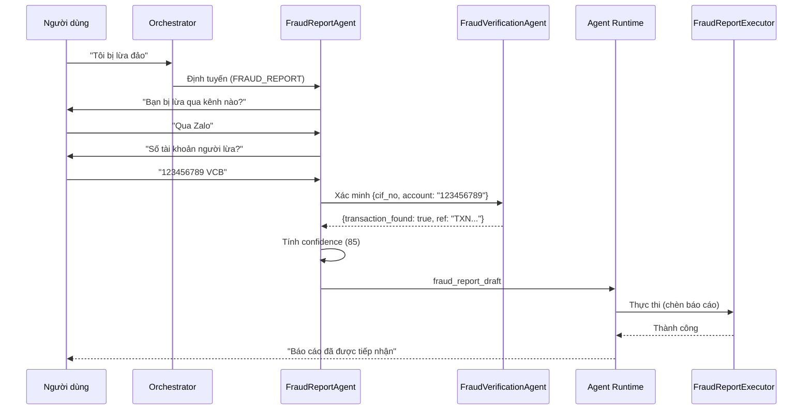

# FraudReportAgent

> Domain Agent chịu trách nhiệm tiếp nhận, xác minh và xử lý báo cáo lừa đảo từ người dùng.

---

## 1. Trách Nhiệm

FraudReportAgent xử lý toàn bộ quy trình báo cáo lừa đảo: từ tiếp nhận ban đầu qua thu thập thông tin đa lượt đến xây dựng bản nháp báo cáo đã xác minh.

| Làm | KHÔNG làm |
|-----|-----------|
| Phân tích thông tin báo cáo lừa đảo (LLM trích xuất) | Khóa tài khoản trực tiếp |
| Ủy quyền cho FraudVerificationAgent | Thực thi side effect |
| Tiến hành phỏng vấn đa lượt (thu thập ngữ cảnh) | Ghi đè Guardian |
| Tính điểm tin cậy (dựa trên quy tắc) | Đưa ra kết luận lừa đảo cuối cùng |
| Xây dựng fraud_report_draft | Cập nhật reported_accounts trực tiếp |
| Hướng dẫn người dùng thu thập bằng chứng | Tự phê duyệt hành động |

---

## 2. Pipeline

```text
┌─────────────────────────────────────────────────────────┐
│ 1. NHẬN YÊU CẦU ĐÃ ĐỊNH TUYẾN                         │
│    Input: user_message (ví dụ: "Tôi bị lừa đảo")      │
│    Nguồn: Orchestrator (task_type = FRAUD_REPORT)       │
└────────────────────────────┬────────────────────────────┘
                             │
                             ▼
┌─────────────────────────────────────────────────────────┐
│ 2. TRÍCH XUẤT BAN ĐẦU (gọi LLM)                       │
│    Trích xuất những gì có từ tin nhắn đầu tiên:        │
│    • fraud_type (nếu phát hiện được)                   │
│    • reported_account_no (nếu đề cập)                  │
│    • transaction_ref (nếu đề cập)                      │
│    • contact_channel (nếu đề cập)                      │
│    • reason_text (mô tả)                               │
│    Xác định những gì THIẾU cho báo cáo hoàn chỉnh     │
└────────────────────────────┬────────────────────────────┘
                             │
                             ▼
┌─────────────────────────────────────────────────────────┐
│ 3. THU THẬP THÔNG TIN ĐA LƯỢT                          │
│    Đặt câu hỏi có cấu trúc để thu thập:               │
│    Q1: "Bạn bị lừa qua kênh nào?" (contact_channel)   │
│    Q2: "Số tài khoản người lừa đảo?" (account_no)     │
│    Q3: "Ngân hàng nào?" (bank_code)                    │
│    Q4: "Giao dịch nào liên quan?" (transaction_ref)    │
│    Q5: "Hậu quả hiện tại?" (aftermath)                 │
│    Q6: "Bạn có bằng chứng?" (has_evidence)             │
│    → Chỉ hỏi câu nào có trường còn thiếu              │
│    → Bỏ qua câu hỏi đã được trả lời trong tin nhắn    │
└────────────────────────────┬────────────────────────────┘
                             │
                             ▼
┌─────────────────────────────────────────────────────────┐
│ 4. XÁC MINH (ủy quyền cho FraudVerificationAgent)     │
│    • Xác minh người dùng thực sự có giao dịch đến     │
│      tài khoản bị báo cáo (qua tra cứu lịch sử)      │
│    • Kiểm tra reported_account_no đã tồn tại trong    │
│      bảng reported_accounts chưa                       │
│    • Trả về bằng chứng xác minh                        │
└────────────────────────────┬────────────────────────────┘
                             │
                             ▼
┌─────────────────────────────────────────────────────────┐
│ 5. TÍNH ĐIỂM TIN CẬY (dựa quy tắc, không dùng LLM)   │
│    Score = base_score                                   │
│      + has_evidence_bonus (+20)                         │
│      + verified_transaction_bonus (+15)                 │
│      + existing_reports_bonus (+10 mỗi báo cáo)        │
│      + detailed_description_bonus (+10)                 │
│      - no_transaction_penalty (-20)                     │
│    Giới hạn trong [30, 100]                             │
└────────────────────────────┬────────────────────────────┘
                             │
                             ▼
┌─────────────────────────────────────────────────────────┐
│ 6. XÂY DỰNG BẢN NHÁP BÁO CÁO LỪA ĐẢO                │
│    {                                                    │
│      reporter_cif_no, transaction_ref,                  │
│      reported_account_no, reported_bank_code,           │
│      fraud_type, contact_channel, aftermath,            │
│      reason_text, has_evidence, confidence_score,       │
│      status: "SUBMITTED"                                │
│    }                                                    │
└────────────────────────────┬────────────────────────────┘
                             │
                             ▼
┌─────────────────────────────────────────────────────────┐
│ 7. TRẢ VỀ CHO AGENT RUNTIME                            │
│    → Guardian xác thực (rủi ro thấp, thường GREEN)     │
│    → FraudReportExecutor chèn vào fraud_reports        │
│    → Cập nhật reported_accounts aggregate              │
│    → Cập nhật reported_customers nếu áp dụng          │
│    → Audit log ghi lại toàn bộ trace                   │
└─────────────────────────────────────────────────────────┘
```

---

## 3. Luồng Phỏng Vấn Đa Lượt

```text
Lượt 1: Người dùng nói "Tôi bị lừa chuyển tiền qua Zalo"
  → Trích xuất: fraud_type=SCAM_TRANSFER, contact_channel=ZALO
  → Thiếu: reported_account_no, bank_code, transaction_ref, aftermath, evidence

Lượt 2: Agent hỏi "Số tài khoản người lừa đảo là gì? Ngân hàng nào?"
  → Người dùng: "Tài khoản 123456789 ngân hàng VCB"
  → Trích xuất: reported_account_no=123456789, bank_code=VCB

Lượt 3: Agent hỏi "Bạn có mã giao dịch không? (có thể xem trong lịch sử)"
  → Người dùng: "Không nhớ, chuyển hôm qua 5 triệu"
  → Ủy quyền cho FraudVerificationAgent tìm giao dịch phù hợp

Lượt 4: Agent hỏi "Hiện tại tình trạng thế nào? (mất tiền, bị block, ...)"
  → Người dùng: "Mất tiền rồi, đối phương block Zalo"
  → Trích xuất: aftermath=BLOCKED_CONTACT

Lượt 5: Agent hỏi "Bạn có screenshot hoặc bằng chứng nào không?"
  → Người dùng: "Có screenshot chat"
  → Trích xuất: has_evidence=true

Lượt 6: Agent xác nhận và gửi báo cáo
```

---

## 4. Quy Tắc Tính Điểm Tin Cậy

| Yếu tố | Điểm | Điều kiện |
|---------|------|-----------|
| Điểm cơ bản | 50 | Luôn có |
| Có bằng chứng | +20 | has_evidence = true |
| Giao dịch xác minh tồn tại | +15 | FraudVerificationAgent xác nhận có giao dịch |
| Báo cáo hiện có cho cùng tài khoản | +10 mỗi | reported_accounts đã có bản ghi |
| Mô tả chi tiết (>50 ký tự) | +10 | reason_text length > 50 |
| Không tìm thấy giao dịch phù hợp | -20 | Không xác minh được giao dịch nào |
| Mô tả mơ hồ (<20 ký tự) | -10 | reason_text length < 20 |

**Phạm vi điểm:**
- 80-100: Tin cậy cao → status = VALIDATED
- 50-79: Tin cậy trung bình → status = SUBMITTED (cần xem xét thủ công)
- 30-49: Tin cậy thấp → status = SUBMITTED (đánh dấu cần xem xét)

---

## 5. Schema Bản Nháp Báo Cáo

```json
{
  "action_type": "FRAUD_REPORT",
  "cif_no": "CIF000032",
  "api_name": "fraud_report_service",
  "report_draft": {
    "reporter_cif_no": "CIF000032",
    "transaction_ref": "TXN202605003200",
    "reported_account_no": "8812520566",
    "reported_bank_code": "VPB",
    "reported_customer_cif": null,
    "fraud_type": "LOAN_SCAM",
    "contact_channel": "ZALO",
    "aftermath": "BLOCKED_CONTACT",
    "reason_text": "Bi lua dao qua zalo, hua cho vay lai suat thap, yeu cau chuyen phi truoc 5 trieu",
    "has_evidence": true,
    "confidence_score": 85,
    "status": "VALIDATED"
  },
  "verification_evidence": {
    "transaction_found": true,
    "transaction_ref": "TXN202605003200",
    "transaction_amount": 5000000,
    "existing_reports_count": 1
  }
}
```

---

## 6. Tương Tác Với Các Thành Phần Khác

```text
FraudReportAgent
  ├── ủy quyền cho → FraudVerificationAgent
  │     • Xác minh người dùng có giao dịch đến tài khoản bị báo cáo
  │     • Kiểm tra reported_accounts cho báo cáo hiện có
  │     • Trả về: { transaction_found, existing_reports_count }
  │
  ├── ủy quyền cho → TransactionHistoryAgent (qua FraudVerification)
  │     • Tìm kiếm giao dịch quá khứ phù hợp tiêu chí
  │     • Trả về: transaction_ref phù hợp
  │
  ├── trả draft cho → Agent Runtime
  │     • Agent Runtime → Guardian (xác thực)
  │     • Guardian → FrictionRouter (thường GREEN cho báo cáo)
  │     • FraudReportExecutor chèn báo cáo
  │
  └── hiệu ứng sau thực thi:
        • fraud_reports: chèn hàng mới
        • reported_accounts: valid_report_count++, tính lại rủi ro
        • reported_customers: cập nhật nếu biết linked_customer_cif
```

---

## 7. Xử Lý Biên (Edge Cases)

| Tình huống | Cách xử lý |
|------------|-------------|
| Người dùng không thể cung cấp số tài khoản | Hỏi xem có thể kiểm tra lịch sử giao dịch không; đề nghị tìm kiếm |
| Tài khoản bị báo cáo đã ở mức CRITICAL | Thông báo người dùng, vẫn nhận báo cáo (bổ sung bằng chứng) |
| Người dùng báo cáo tài khoản của chính mình | Từ chối: reporter_cif không thể sở hữu reported_account |
| Không tìm thấy giao dịch đến tài khoản bị báo cáo | Nhận báo cáo với confidence thấp hơn, đánh dấu cần xem xét |
| Người dùng muốn kiểm tra trạng thái báo cáo | Định tuyến sang thao tác CHECK_FRAUD_STATUS |
| Báo cáo trùng lặp (cùng người dùng, cùng tài khoản) | Cảnh báo người dùng, hỏi có phải sự cố mới hay cập nhật |

---

## 8. Sơ Đồ Tuần Tự


