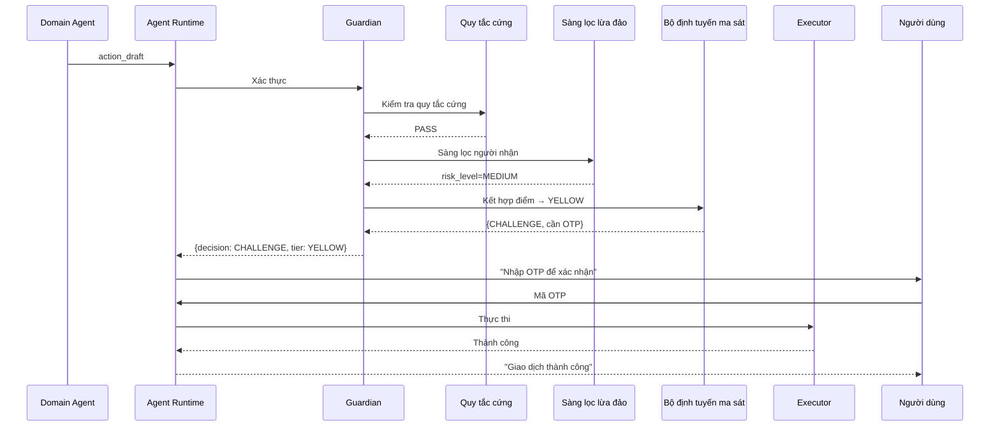

# Guardian

> Lớp an toàn trung tâm chịu trách nhiệm xác thực tất cả hành động của agent trước khi thực thi.

---

## 1. Trách Nhiệm

Guardian là checkpoint bắt buộc giữa domain agent (xây dựng draft) và executor (gọi API). Mọi action draft đều đi qua Guardian — không có ngoại lệ.

| Làm | KHÔNG làm |
|-----|-----------|
| Áp dụng quy tắc cứng (tất định) | Tạo action draft |
| Tính điểm rủi ro dựa trên mô hình | Gọi API ngân hàng |
| Sàng lọc giao dịch qua CSDL lừa đảo | Xử lý hội thoại người dùng |
| Định tuyến ma sát (OTP, xác nhận, chặn) | Đưa ra quyết định kinh doanh |
| Ghi log tất cả quyết định vào audit trail | Ghi đè sự đồng ý rõ ràng của người dùng |
| Thực thi giới hạn tốc độ và kiểm tra velocity | Tự phê duyệt chính mình |

---

## 2. Pipeline

```text
┌─────────────────────────────────────────────────────────┐
│ 1. NHẬN ACTION DRAFT                                    │
│    Từ: Agent Runtime (sau khi domain agent hoàn thành)  │
│    Input: { action_type, cif_no, api_payload, ... }     │
└────────────────────────────┬────────────────────────────┘
                             │
                             ▼
┌─────────────────────────────────────────────────────────┐
│ 2. ENGINE QUY TẮC CỨNG (tất định, không dùng LLM)     │
│    Kiểm tra theo quy tắc bất biến:                     │
│    • Hạn mức ngày: tổng_hôm_nay + amount ≤ daily_max  │
│    • Hạn mức giao dịch đơn: amount ≤ single_max       │
│    • Chặn tự chuyển: from_acc ≠ to_acc owner           │
│    • Khớp tiền tệ: amount_currency == account_currency │
│    • Trạng thái tài khoản: phải là ACTIVE              │
│    → FAIL: BLOCK ngay lập tức (không thể ghi đè)      │
│    → PASS: tiếp tục lớp tiếp theo                      │
└────────────────────────────┬────────────────────────────┘
                             │
                             ▼
┌─────────────────────────────────────────────────────────┐
│ 3. SÀNG LỌC GIAO DỊCH                                  │
│    Kiểm tra reported_accounts + reported_customers:     │
│    • Người nhận có trong reported_accounts không?       │
│    • risk_level của người nhận là gì?                   │
│    • valid_report_count là bao nhiêu?                   │
│    Đánh giá rủi ro:                                     │
│    • CRITICAL → BLOCK (tự động từ chối)                │
│    • HIGH → ORANGE (cần phê duyệt quản lý)            │
│    • MEDIUM → YELLOW (OTP + cảnh báo)                  │
│    • LOW / NOT_FOUND → tiếp tục                        │
│    → BLOCK hoặc NÂNG CẤP mức ma sát                   │
└────────────────────────────┬────────────────────────────┘
                             │
                             ▼
┌─────────────────────────────────────────────────────────┐
│ 4. KIỂM TRA VELOCITY & BẤT THƯỜNG                      │
│    • Số lượng giao dịch trong 1h, 24h qua             │
│    • Số tiền so với hành vi thường ngày (std dev)      │
│    • Thời gian bất thường (2h-5h sáng)                 │
│    • Combo người nhận mới + số tiền lớn                │
│    → Điểm: velocity_risk (0-100)                       │
└────────────────────────────┬────────────────────────────┘
                             │
                             ▼
┌─────────────────────────────────────────────────────────┐
│ 5. TÍNH ĐIỂM RỦI RO DỰA TRÊN MÔ HÌNH (tùy chọn)     │
│    • Input features: amount, time, recipient_history,   │
│      user_pattern, device_info                          │
│    • Output: risk_score (0-100)                         │
│    • Hackathon: scoring dựa quy tắc đơn giản          │
│    • Production: suy luận ML model                      │
└────────────────────────────┬────────────────────────────┘
                             │
                             ▼
┌─────────────────────────────────────────────────────────┐
│ 6. BỘ ĐỊNH TUYẾN MA SÁT                                │
│    Kết hợp tất cả tín hiệu thành quyết định cuối:     │
│    final_risk = max(fraud_screening, velocity, model)   │
│    Ánh xạ sang bậc ma sát:                             │
│    • GREEN (0-25): Tự phê duyệt, không xác minh thêm  │
│    • YELLOW (26-50): OTP + tin nhắn xác nhận           │
│    • ORANGE (51-75): OTP + thời gian chờ + cảnh báo   │
│    • RED (76-100): BLOCK, chuyển sang nhân viên        │
└────────────────────────────┬────────────────────────────┘
                             │
                             ▼
┌─────────────────────────────────────────────────────────┐
│ 7. TRẢ VỀ QUYẾT ĐỊNH                                   │
│    {                                                    │
│      decision: ALLOW | CHALLENGE | BLOCK,               │
│      friction_tier: GREEN | YELLOW | ORANGE | RED,      │
│      required_actions: [OTP, CONFIRM, COOLDOWN],        │
│      risk_breakdown: {...},                              │
│      reason: "..."                                      │
│    }                                                    │
└─────────────────────────────────────────────────────────┘
```

---

## 3. Engine Quy Tắc Cứng

Các quy tắc này là **bất biến** — không thể bị ghi đè bởi người dùng, LLM, hay bất kỳ agent nào.

| Quy tắc | Điều kiện | Hành động |
|---------|-----------|-----------|
| Vượt hạn mức ngày | sum_today + amount > daily_max | BLOCK |
| Vượt giao dịch đơn tối đa | amount > single_transaction_max | BLOCK |
| Vòng lặp tự chuyển | from_account.owner == to_account.owner (cùng ngân hàng) | WARN (cho phép) |
| Tài khoản không hoạt động | account.status ≠ ACTIVE | BLOCK |
| Thẻ hết hạn | card.expiry_date < today | BLOCK |
| Không khớp tiền tệ | payload.currency ≠ account.currency | BLOCK |
| Số tiền âm | amount ≤ 0 | BLOCK |

---

## 4. Chi Tiết Sàng Lọc Lừa Đảo

```text
Input: recipient_account_no, recipient_bank_code

Bước 1: Truy vấn reported_accounts
  SELECT risk_level, valid_report_count, last_reported_at
  FROM reported_accounts
  WHERE account_no = :recipient AND bank_code = :bank

Bước 2: Ma trận quyết định

  ┌────────────────┬──────────────┬───────────────────────────┐
  │ risk_level     │ Ma sát       │ Thông báo người dùng      │
  ├────────────────┼──────────────┼───────────────────────────┤
  │ CRITICAL       │ RED (BLOCK)  │ "TK đã bị báo cáo lừa    │
  │                │              │  đảo nhiều lần, giao dịch  │
  │                │              │  bị chặn"                  │
  ├────────────────┼──────────────┼───────────────────────────┤
  │ HIGH           │ ORANGE       │ "TK có nhiều báo cáo lừa  │
  │                │              │  đảo. Xác nhận tiếp tục?" │
  ├────────────────┼──────────────┼───────────────────────────┤
  │ MEDIUM         │ YELLOW       │ "TK đã từng bị báo cáo.   │
  │                │              │  Bạn có chắc không?"       │
  ├────────────────┼──────────────┼───────────────────────────┤
  │ LOW            │ GREEN        │ Không cảnh báo            │
  ├────────────────┼──────────────┼───────────────────────────┤
  │ NOT_FOUND      │ GREEN        │ Không cảnh báo            │
  └────────────────┴──────────────┴───────────────────────────┘
```

---

## 5. Các Bậc Ma Sát

| Bậc | Điểm rủi ro | Hành động yêu cầu | Trải nghiệm người dùng |
|-----|-------------|-------------------|------------------------|
| GREEN | 0-25 | Không (tự phê duyệt) | Chỉ nút xác nhận |
| YELLOW | 26-50 | Xác minh OTP | "Nhập OTP để xác nhận" |
| ORANGE | 51-75 | OTP + chờ 30s + cảnh báo | "Cảnh báo: ... Nhập OTP sau 30s" |
| RED | 76-100 | BLOCK (không thể ghi đè qua chat) | "Giao dịch bị chặn. Liên hệ hotline" |

**Quy tắc leo thang bậc:**
- Sàng lọc lừa đảo chỉ có thể NÂNG bậc (không bao giờ hạ)
- Nếu quy tắc cứng thất bại → RED (bỏ qua scoring hoàn toàn)
- Nhiều tín hiệu YELLOW → leo thang lên ORANGE

---

## 6. Schema Output Quyết Định

```json
{
  "decision": "CHALLENGE",
  "friction_tier": "YELLOW",
  "risk_score": 42,
  "risk_breakdown": {
    "hard_rules": "PASS",
    "fraud_screening": "LOW",
    "velocity_risk": 15,
    "anomaly_score": 42,
    "model_score": null
  },
  "required_actions": ["OTP"],
  "reason": "Số tiền 50M vượt giao dịch thông thường (trung bình 5M). Người nhận mới.",
  "warnings": [
    "Số tiền giao dịch lớn hơn bình thường"
  ],
  "audit_ref": "GRD-20260501-001234"
}
```

---

## 7. Xử Lý Biên (Edge Cases)

| Tình huống | Cách xử lý |
|------------|-------------|
| Guardian service timeout | BLOCK mặc định (fail-closed) |
| Người nhận không trong fraud DB nhưng khả nghi | Chỉ dùng velocity+anomaly |
| Người dùng có hạn mức ngày cao nhưng số tiền bất thường | Vẫn kích hoạt YELLOW+ qua anomaly |
| Khóa thẻ (an toàn khẩn cấp) | GREEN — hành động an toàn được ma sát thấp hơn |
| Gửi báo cáo lừa đảo | GREEN — tiếp nhận báo cáo là rủi ro thấp |
| Nhiều giao dịch đồng thời | Velocity check bắt mẫu burst |
| System user (batch process) | Bộ quy tắc khác (system limits áp dụng) |

---

## 8. Vị Trí Trong Kiến Trúc

```text
┌──────────────────────────────────────────────────┐
│                 AGENT RUNTIME                      │
│                                                    │
│  Domain Agent → action_draft → ┌────────────┐    │
│                                │  GUARDIAN   │    │
│                                │             │    │
│                                │ Quy tắc cứng│    │
│                                │     ↓       │    │
│                                │ Sàng lọc    │    │
│                                │ lừa đảo     │    │
│                                │     ↓       │    │
│                                │ Velocity    │    │
│                                │     ↓       │    │
│                                │ ML Score    │    │
│                                │     ↓       │    │
│                                │ Bộ định     │    │
│                                │ tuyến ma sát│    │
│                                └──────┬─────┘    │
│                                       │           │
│                 ┌─────────────────────┼──────┐   │
│                 │ GREEN  YELLOW  ORANGE  RED  │   │
│                 │  ↓       ↓       ↓      ↓  │   │
│                 │ Thực thi OTP+TT Chờ   Chặn │   │
│                 └────────────────────────────┘   │
└──────────────────────────────────────────────────┘
```

---

## 9. Sơ Đồ Tuần Tự


