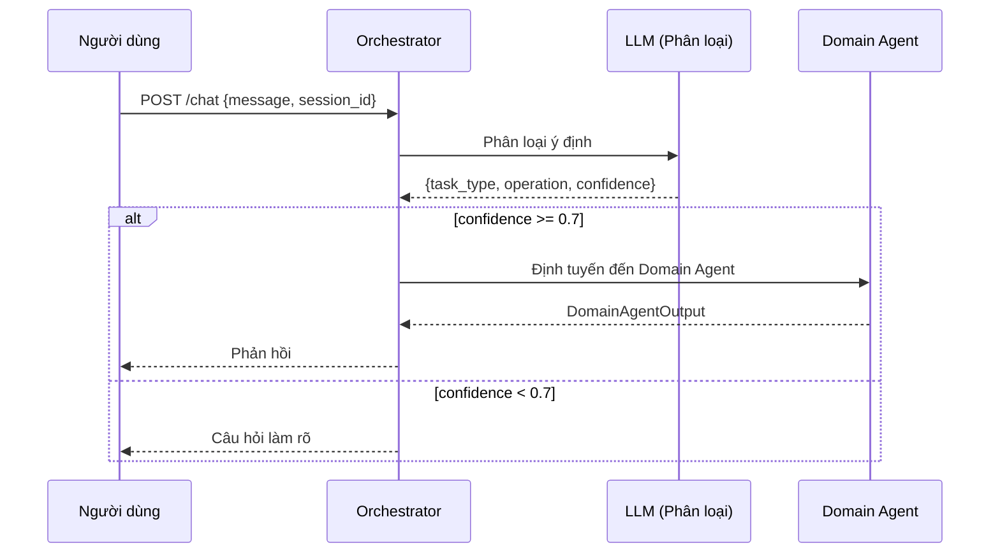

# Orchestrator

> Điểm vào duy nhất phân loại ý định người dùng và định tuyến đến Domain Agent phù hợp.

---

## 1. Trách nhiệm

Orchestrator là **lớp định tuyến mỏng**. Nó thực hiện đúng một lần gọi LLM để phân loại ý định, sau đó ủy quyền mọi thứ cho Domain Agent tương ứng.

| Làm | KHÔNG làm |
|-----|-----------|
| Phân loại ý định (1 lần gọi LLM) | Trích xuất thực thể từ tin nhắn |
| Định tuyến đến Domain Agent theo `task_type` | Xử lý logic nghiệp vụ |
| Trả về phản hồi của Domain Agent cho người gọi | Đưa ra quyết định rủi ro |
| Xử lý ý định không xác định | Gọi sub-agent trực tiếp |
| Duy trì phiên hội thoại | Thực thi bất kỳ side effect nào |

---

## 2. Pipeline

```text
┌─────────────────────────────────────────────────────────┐
│ 1. NHẬN YÊU CẦU                                        │
│    Input: { message, session_id, cif_no }               │
└────────────────────────────┬────────────────────────────┘
                             │
                             ▼
┌─────────────────────────────────────────────────────────┐
│ 2. PHÂN LOẠI Ý ĐỊNH (1 lần gọi LLM)                   │
│    Prompt: INTENT_SYSTEM_PROMPT + tin nhắn người dùng  │
│    Output: { task_type, operation, confidence, reason }  │
└────────────────────────────┬────────────────────────────┘
                             │
                             ▼
┌─────────────────────────────────────────────────────────┐
│ 3. KIỂM TRA ĐỘ TIN CẬY                                │
│    Nếu confidence < 0.7 → hỏi lại để làm rõ           │
│    Nếu confidence >= 0.7 → tiếp tục định tuyến         │
└────────────────────────────┬────────────────────────────┘
                             │
                             ▼
┌─────────────────────────────────────────────────────────┐
│ 4. ĐỊNH TUYẾN ĐẾN DOMAIN AGENT                         │
│    task_type → Agent tương ứng:                         │
│    • TRANSACTION      → TransactionAgent                │
│    • CARD_OPERATION   → CardAgent                       │
│    • DATA_QUERY       → DataQueryAgent                  │
│    • QA               → QAAgent                         │
│    • FRAUD_REPORT     → FraudReportAgent                │
│    • ACCOUNT_OPERATION→ AccountAgent                    │
│    • LOAN_OPERATION   → LoanAgent                       │
└────────────────────────────┬────────────────────────────┘
                             │
                             ▼
┌─────────────────────────────────────────────────────────┐
│ 5. TRẢ VỀ PHẢN HỒI                                     │
│    Truyền output của Domain Agent về cho người dùng    │
│    Bao gồm: response_text, action_draft (nếu có),     │
│             risk_tier, audit_trace                       │
└─────────────────────────────────────────────────────────┘
```

---

## 3. Schema Phân Loại Ý Định

### Input

```json
{
  "message": "Chuyển cho Minh 2 triệu",
  "session_id": "sess_abc123",
  "cif_no": "CIF000001"
}
```

### Output từ LLM

```json
{
  "task_type": "TRANSACTION",
  "operation": "TRANSFER_MONEY",
  "confidence": 0.98,
  "reason": "Người dùng muốn thực hiện chuyển tiền."
}
```

---

## 4. Bảng Định Tuyến

| task_type | Domain Agent | Các thao tác |
|-----------|-------------|--------------|
| QA | QAAgent | câu hỏi chính sách, phí, lãi suất, sản phẩm |
| DATA_QUERY | DataQueryAgent | số dư, chi tiêu, lịch sử, phân tích |
| TRANSACTION | TransactionAgent | TRANSFER_MONEY, BILL_PAYMENT, TOP_UP |
| CARD_OPERATION | CardAgent | LOCK_CARD, UNLOCK_CARD, CHANGE_CARD_LIMIT, ... |
| ACCOUNT_OPERATION | AccountAgent | OPEN_ACCOUNT, CLOSE_ACCOUNT, MANAGE_BENEFICIARY, ... |
| LOAN_OPERATION | LoanAgent | APPLY_LOAN, REPAY_LOAN, CHECK_LOAN_STATUS, ... |
| FRAUD_REPORT | FraudReportAgent | REPORT_FRAUD, CHECK_FRAUD_STATUS |

---

## 5. Xử Lý Biên (Edge Cases)

| Tình huống | Cách xử lý |
|------------|-------------|
| Độ tin cậy thấp (< 0.7) | Trả câu hỏi làm rõ cho người dùng |
| Phát hiện nhiều ý định | Ưu tiên: FRAUD_REPORT > TRANSACTION > CARD > ACCOUNT > LOAN > DATA_QUERY > QA |
| Ý định không xác định | Fallback sang QAAgent với phản hồi chung |
| Nỗ lực prompt injection | Bộ phân loại ý định xử lý như QA, Guardian chặn nếu cần |
| Tin nhắn rỗng | Trả lời chào/hướng dẫn chung |

---

## 6. Sơ Đồ Tuần Tự


