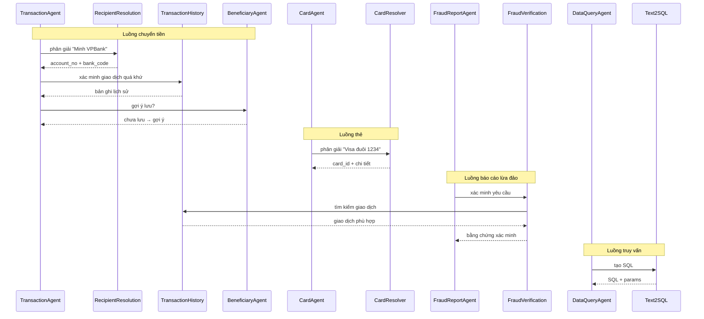

# Sub-Agents

> Các agent chuyên biệt hướng tác vụ, được gọi bởi domain agent để xử lý các sub-task cụ thể.

---

## Tổng Quan

Sub-agent là các agent nhẹ, tập trung vào một trách nhiệm duy nhất. Chúng không bao giờ được Orchestrator gọi trực tiếp — luôn được ủy quyền bởi domain agent.

```text
Domain Agents (gọi sub-agents)
├── TransactionAgent → RecipientResolutionAgent
│                    → TransactionHistoryAgent
│                    → BeneficiaryAgent
├── CardAgent → CardResolverAgent
├── FraudReportAgent → FraudVerificationAgent
├── DataQueryAgent → Text2SQLAgent
│                  → PolicyRetrieverAgent
└── Tất cả Agents → PolicyRetrieverAgent (tra cứu quy tắc)
```

---

## 1. RecipientResolutionAgent

**Agent cha:** TransactionAgent  
**Mục đích:** Phân giải tham chiếu người nhận mơ hồ thành số tài khoản cụ thể.

### Input

```json
{
  "task_type": "resolve_recipient",
  "constraints": {
    "cif_no": "CIF000001",
    "recipient_hint": "Minh VPBank",
    "amount": 5000000
  }
}
```

### Chiến Lược Phân Giải

| Ưu tiên | Chiến lược | Điều kiện |
|---------|----------|-----------|
| 1 | Khớp chính xác trong beneficiaries | hint khớp nickname hoặc tên |
| 2 | Khớp mờ trong beneficiaries | Khoảng cách Levenshtein ≤ 2 |
| 3 | Tìm kiếm lịch sử giao dịch | Tìm giao dịch quá khứ với counterparty tương tự |
| 4 | Hỏi người dùng | Nhiều ứng viên hoặc không khớp |

### Output

```json
{
  "status": "RESOLVED",
  "recipient": {
    "account_no": "8812520566",
    "bank_code": "VPB",
    "account_name": "NGUYEN VAN MINH",
    "source": "beneficiaries"
  },
  "confidence": 0.95,
  "alternatives": []
}
```

### Xử Lý Biên
- Nhiều kết quả khớp → trả top 3 ứng viên cho người dùng chọn
- Không khớp → thông báo người dùng, yêu cầu số tài khoản trực tiếp
- Thông tin một phần (tên không có ngân hàng) → lọc beneficiaries theo tên, trình bày lựa chọn

---

## 2. TransactionHistoryAgent

**Agent cha:** TransactionAgent, FraudVerificationAgent  
**Mục đích:** Tìm kiếm và lọc lịch sử giao dịch của người dùng.

### Input

```json
{
  "task_type": "search_transactions",
  "constraints": {
    "cif_no": "CIF000001",
    "counterparty_account": "8812520566",
    "time_range": "last_7_days",
    "direction": "OUT",
    "amount_range": [4000000, 6000000]
  }
}
```

### Khả Năng
- Lọc theo: khoảng thời gian, phạm vi số tiền, counterparty, hướng, danh mục
- Sắp xếp theo: ngày (mặc định), số tiền
- Tổng hợp: sum, count, average theo khoảng thời gian
- Trả về: tối đa 20 giao dịch mỗi yêu cầu

### Output

```json
{
  "status": "FOUND",
  "count": 2,
  "transactions": [
    {
      "transaction_ref": "TXN202605003200",
      "amount": 5000000,
      "direction": "OUT",
      "counterparty_name": "NGUYEN VAN MINH",
      "counterparty_account": "8812520566",
      "timestamp": "2026-05-14T10:30:00Z"
    }
  ]
}
```

---

## 3. BeneficiaryAgent

**Agent cha:** TransactionAgent  
**Mục đích:** Quản lý người nhận đã lưu (tra cứu, gợi ý lưu).

### Khả Năng
- Tra cứu beneficiary theo tên, ngân hàng, hoặc số tài khoản
- Sau chuyển khoản thành công đến người nhận mới → gợi ý lưu beneficiary
- Kiểm tra xem người nhận đã được lưu chưa (tránh trùng lặp)

### Input/Output

```json
// Tra cứu
{"task_type": "lookup_beneficiary", "cif_no": "CIF000001", "query": "Minh VPB"}
// → {"found": true, "beneficiary": {...}}

// Gợi ý lưu
{"task_type": "suggest_save", "recipient": {"account_no": "...", "name": "...", "bank": "..."}}
// → Domain agent hỏi người dùng: "Bạn có muốn lưu người nhận này không?"
```

---

## 4. CardResolverAgent

**Agent cha:** CardAgent  
**Mục đích:** Phân giải thẻ nào người dùng đang đề cập.

### Input

```json
{
  "task_type": "resolve_card",
  "constraints": {
    "cif_no": "CIF000001",
    "card_type": "CREDIT",
    "card_network": "VISA",
    "last4": "1234"
  }
}
```

### Logic Phân Giải

```text
1. Lấy tất cả thẻ của người dùng
2. Áp dụng bộ lọc (type, network, last4)
3. Nếu 1 kết quả → trả về
4. Nếu 0 kết quả → thử tìm kiếm nới lỏng (bỏ từng bộ lọc)
5. Nếu nhiều kết quả → trả danh sách với chi tiết cho người dùng chọn
6. Nếu người dùng chỉ có 1 thẻ tổng cộng → sử dụng bất kể bộ lọc
```

### Output

```json
{
  "status": "RESOLVED",
  "card": {
    "card_id": "uuid-card-001",
    "masked_card_no": "**** **** **** 1234",
    "card_type": "CREDIT",
    "card_network": "VISA",
    "status": "ACTIVE",
    "credit_limit": 50000000
  }
}
```

---

## 5. FraudVerificationAgent

**Agent cha:** FraudReportAgent  
**Mục đích:** Xác minh yêu cầu báo cáo lừa đảo bằng cách đối chiếu dữ liệu giao dịch và CSDL lừa đảo.

### Input

```json
{
  "task_type": "verify_fraud_report",
  "constraints": {
    "reporter_cif_no": "CIF000032",
    "reported_account_no": "8812520566",
    "reported_bank_code": "VPB",
    "claimed_amount": 5000000,
    "claimed_timeframe": "yesterday"
  }
}
```

### Các Bước Xác Minh

| Bước | Hành động | Kết quả |
|------|-----------|---------|
| 1 | Tìm giao dịch của người báo cáo đến reported_account | transaction_found (bool) |
| 2 | Kiểm tra bảng reported_accounts | existing_reports_count |
| 3 | Kiểm tra bảng reported_customers | linked_customer_risk |
| 4 | Đối chiếu số tiền và thời gian | amount_matches (bool) |

### Output

```json
{
  "status": "VERIFIED",
  "evidence": {
    "transaction_found": true,
    "transaction_ref": "TXN202605003200",
    "transaction_amount": 5000000,
    "transaction_time": "2026-05-14T10:30:00Z",
    "existing_reports_count": 1,
    "reported_account_risk": "MEDIUM",
    "amount_matches": true
  }
}
```

---

## 6. Text2SQLAgent

**Agent cha:** DataQueryAgent  
**Mục đích:** Tạo SQL an toàn, có phạm vi từ câu hỏi ngôn ngữ tự nhiên.

### Input

```json
{
  "task_type": "generate_sql",
  "constraints": {
    "user_question": "Tháng này tôi tiêu bao nhiêu cho ăn uống?",
    "cif_no": "CIF000001",
    "schema_context": ["transactions", "transaction_categories"],
    "time_context": "2026-05"
  }
}
```

### Quy Tắc Tạo SQL
1. Luôn dùng truy vấn có tham số (`:user_id`, `:start_date`, v.v.)
2. Luôn bao gồm `WHERE cif_no = :user_id`
3. Luôn thêm `LIMIT` (tối đa 100)
4. Chỉ câu lệnh SELECT
5. Chỉ bảng trong danh sách cho phép (xem DataQueryAgent)
6. JOIN chỉ được phép giữa các bảng cho phép

### Output

```json
{
  "status": "GENERATED",
  "sql": "SELECT SUM(t.amount) as total, COUNT(*) as count FROM transactions t JOIN transaction_categories tc ON t.category_id = tc.id WHERE t.cif_no = :user_id AND tc.name = 'FOOD' AND t.transaction_date >= :start_date AND t.transaction_date <= :end_date AND t.direction = 'OUT' LIMIT 1",
  "params": {
    "user_id": "CIF000001",
    "start_date": "2026-05-01",
    "end_date": "2026-05-31"
  },
  "tables_used": ["transactions", "transaction_categories"]
}
```

---

## 7. PolicyRetrieverAgent

**Agent cha:** Bất kỳ domain agent nào  
**Mục đích:** Truy xuất quy tắc chính sách ngân hàng liên quan đến thao tác hiện tại.

### Input

```json
{
  "task_type": "retrieve_policy",
  "constraints": {
    "operation": "TRANSFER",
    "amount": 50000000,
    "account_type": "SAVINGS"
  }
}
```

### Các Loại Chính Sách
- Hạn mức chuyển tiền (ngày, mỗi giao dịch, theo loại tài khoản)
- Chính sách thẻ (hạn mức tối đa, quy tắc khóa/mở khóa)
- Ngưỡng lừa đảo (khi nào leo thang)
- Hạn chế theo thời gian (chuyển tiền ban đêm, quy tắc ngày lễ)
- Yêu cầu KYC (xác minh số tiền lớn)

### Output

```json
{
  "status": "FOUND",
  "policies": [
    {
      "rule_id": "TRF-001",
      "description": "Hạn mức chuyển đơn cho tài khoản tiết kiệm: 500M VND",
      "limit": 500000000,
      "applies_to": "SAVINGS",
      "action": "BLOCK nếu vượt"
    },
    {
      "rule_id": "TRF-002",
      "description": "Chuyển tiền > 50M yêu cầu OTP",
      "threshold": 50000000,
      "action": "Yêu cầu OTP"
    }
  ]
}
```

---

## 8. Bảng So Sánh Tổng Hợp

| Sub-Agent | Agent cha | Kiểu I/O | Có trạng thái? | Dùng LLM? |
|-----------|-----------|----------|----------------|-----------|
| RecipientResolutionAgent | TransactionAgent | DB lookup + LLM mờ | Không | Có (khớp mờ) |
| TransactionHistoryAgent | TransactionAgent, FraudVerification | DB query | Không | Không |
| BeneficiaryAgent | TransactionAgent | DB lookup | Không | Không |
| CardResolverAgent | CardAgent | DB query + lọc | Không | Không |
| FraudVerificationAgent | FraudReportAgent | Multi-DB query | Không | Không |
| Text2SQLAgent | DataQueryAgent | LLM generation | Không | Có (tạo SQL) |
| PolicyRetrieverAgent | Bất kỳ | Config/DB lookup | Không | Không |

---

## 9. Sơ Đồ Tuần Tự (Tổng hợp)


