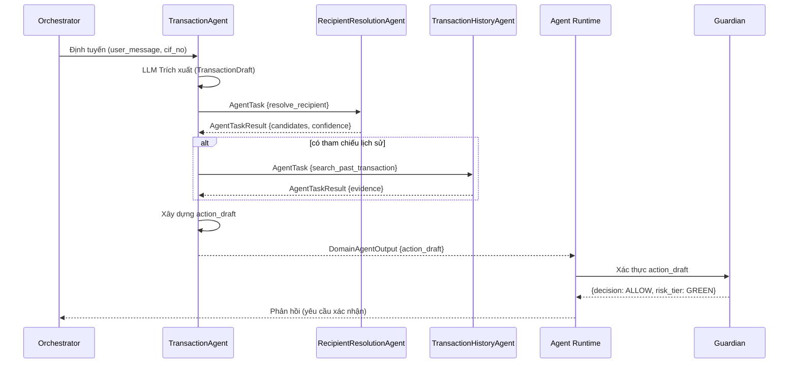

# TransactionAgent

> Domain Agent chịu trách nhiệm xử lý chuyển tiền: chuyển khoản, thanh toán hóa đơn, và nạp tiền.

---

## 1. Trách Nhiệm

TransactionAgent sở hữu toàn bộ workflow từ phân tích yêu cầu giao dịch của người dùng đến xây dựng action draft hoàn chỉnh sẵn sàng cho Guardian kiểm tra.

| Làm | KHÔNG làm |
|-----|-----------|
| Phân tích tin nhắn (LLM trích xuất trường cấu trúc) | Thực thi giao dịch |
| Phát hiện trường thiếu | Gọi API ngân hàng |
| Lập kế hoạch giải quyết (resolution strategy) | Bỏ qua Guardian |
| Ủy quyền cho sub-agent để phân giải ngữ cảnh | Tự phê duyệt rủi ro |
| Thu thập output có bằng chứng hỗ trợ | Ghi đè quyết định Guardian |
| Xây dựng và trả về action_draft | Tự điền trường rủi ro cao thiếu bằng chứng |

---

## 2. Pipeline

```text
┌─────────────────────────────────────────────────────────┐
│ 1. NHẬN YÊU CẦU ĐÃ ĐỊNH TUYẾN                         │
│    Input: user_message + session context + cif_no       │
│    Nguồn: Orchestrator (task_type = TRANSACTION)        │
└────────────────────────────┬────────────────────────────┘
                             │
                             ▼
┌─────────────────────────────────────────────────────────┐
│ 2. TRÍCH XUẤT GIAO DỊCH (gọi LLM)                     │
│    Prompt: TRANSACTION_SYSTEM_PROMPT + tin nhắn         │
│    Output: TransactionDraft {                           │
│      action, amount, recipient_hint,                    │
│      recipient_account, recipient_bank,                 │
│      reference_context, missing_fields, ...             │
│    }                                                    │
└────────────────────────────┬────────────────────────────┘
                             │
                             ▼
┌─────────────────────────────────────────────────────────┐
│ 3. LẬP KẾ HOẠCH GIẢI QUYẾT                             │
│    Kiểm tra missing_fields và resolvable_fields:        │
│    • recipient_account thiếu + có hint                  │
│      → kế hoạch: gọi RecipientResolutionAgent          │
│    • Tham chiếu giao dịch quá khứ                      │
│      → kế hoạch: gọi TransactionHistoryAgent           │
│    • Nhà cung cấp hóa đơn nhưng thiếu customer_code   │
│      → kế hoạch: gọi BillerResolutionAgent             │
│    • Cần nhiều resolution → gọi tuần tự               │
└────────────────────────────┬────────────────────────────┘
                             │
                             ▼
┌─────────────────────────────────────────────────────────┐
│ 4. ỦY QUYỀN CHO SUB-AGENT                              │
│    Gửi AgentTask có cấu trúc đến từng sub-agent:      │
│    • RecipientResolutionAgent                           │
│    • TransactionHistoryAgent                            │
│    • BillerResolutionAgent                              │
│    Nhận AgentTaskResult với candidates + evidence       │
└────────────────────────────┬────────────────────────────┘
                             │
                             ▼
┌─────────────────────────────────────────────────────────┐
│ 5. ĐÁNH GIÁ ỨNG VIÊN                                   │
│    • 1 ứng viên + confidence cao → sử dụng ngay       │
│    • Nhiều ứng viên → hỏi người dùng để phân biệt     │
│    • Không có ứng viên → hỏi thông tin rõ ràng         │
│    • Confidence thấp → hỏi xác nhận                    │
└────────────────────────────┬────────────────────────────┘
                             │
                             ▼
┌─────────────────────────────────────────────────────────┐
│ 6. XÂY DỰNG ACTION DRAFT                               │
│    Lắp ráp action_draft hoàn chỉnh:                    │
│    {                                                    │
│      action_type: "TRANSFER",                           │
│      cif_no, from_account, to_account, to_bank,        │
│      to_name, amount, currency, description,            │
│      evidence: [...], confidence, source_agent          │
│    }                                                    │
└────────────────────────────┬────────────────────────────┘
                             │
                             ▼
┌─────────────────────────────────────────────────────────┐
│ 7. TRẢ VỀ CHO AGENT RUNTIME                            │
│    → Agent Runtime gửi draft đến Guardian              │
│    → Guardian xác thực → xếp hạng rủi ro              │
│    → Cổng ma sát/xác thực                              │
│    → Executor thực hiện side effect                    │
└─────────────────────────────────────────────────────────┘
```

---

## 3. Các Thao Tác Hỗ Trợ

| Thao tác | Mô tả | Trường bắt buộc |
|----------|--------|-----------------|
| TRANSFER_MONEY | Chuyển khoản ngân hàng | amount, to_account, to_bank, to_name |
| BILL_PAYMENT | Thanh toán hóa đơn dịch vụ | bill_provider, customer_code, amount |
| TOP_UP | Nạp tiền điện thoại/ví | amount, topup_target (phone/wallet) |

---

## 4. Chiến Lược Giải Quyết (Resolution)

### 4.1 Phân Giải Người Nhận

**Trigger:** `recipient_hint` có nhưng `recipient_account` thiếu.

```text
TransactionAgent
  → RecipientResolutionAgent {
      task_type: "resolve_recipient",
      constraints: { cif_no, recipient_name: "Minh" }
    }
  ← AgentTaskResult {
      candidates: [
        { name: "Nguyen Van Minh", account: "123456789", bank: "VCB", source: "beneficiaries" },
        { name: "Tran Minh", account: "987654321", bank: "TCB", source: "beneficiaries" }
      ],
      confidence: 0.6  // mơ hồ → hỏi người dùng
    }
```

**Logic quyết định:**
- 1 ứng viên + confidence > 0.85 → tự động điền
- 1 ứng viên + confidence 0.7-0.85 → xác nhận với người dùng
- Nhiều ứng viên → trình bày lựa chọn cho người dùng
- 0 ứng viên → hỏi người dùng số tài khoản rõ ràng

### 4.2 Phân Giải Tham Chiếu Lịch Sử

**Trigger:** `reference_context.has_reference = true`

```text
TransactionAgent
  → TransactionHistoryAgent {
      task_type: "search_past_transaction",
      constraints: { cif_no, recipient_name: "Minh", time_range: "last_month" }
    }
  ← AgentTaskResult {
      candidates: [
        { transaction_ref: "TXN202604001234", to_account: "123456789",
          to_bank: "VCB", to_name: "Nguyen Van Minh", amount: 2000000 }
      ],
      evidence: ["TXN202604001234"],
      confidence: 0.92
    }
```

### 4.3 Phân Giải Nhà Cung Cấp Hóa Đơn

**Trigger:** `bill_provider` có nhưng `customer_code` thiếu.

```text
TransactionAgent
  → BillerResolutionAgent {
      task_type: "resolve_biller",
      constraints: { cif_no, bill_type: "electricity" }
    }
  ← AgentTaskResult {
      candidates: [
        { biller_code: "EVN_HANOI", customer_bill_code: "PD123456789", alias: "Nhà Hà Nội" }
      ],
      confidence: 0.95
    }
```

---

## 5. Schema Action Draft

```json
{
  "action_type": "TRANSFER",
  "cif_no": "CIF000001",
  "api_name": "external_transfer_api",
  "api_payload": {
    "from_account_no": "92644220969",
    "to_account_no": "123456789",
    "to_bank_code": "VCB",
    "to_name": "Nguyen Van Minh",
    "amount": 2000000,
    "currency": "VND",
    "description": "Chuyen tien cho Minh"
  },
  "resolved_entities": {
    "recipient_name": "Nguyen Van Minh",
    "recipient_account": "123456789",
    "recipient_bank": "VCB",
    "amount": 2000000,
    "source_account": "92644220969"
  },
  "evidence": {
    "recipient_source": "beneficiaries",
    "recipient_confidence": 0.95,
    "history_match": "TXN202604001234"
  },
  "missing_fields": [],
  "risk_indicators": {
    "is_new_recipient": false,
    "amount_vs_average": 1.2,
    "unusual_time": false
  }
}
```

---

## 6. Xử Lý Biên (Edge Cases)

| Tình huống | Cách xử lý |
|------------|-------------|
| Người nhận mơ hồ ("Minh" khớp 2 người) | Trả câu hỏi phân biệt kèm lựa chọn |
| Số tiền mơ hồ ("vài triệu") | Hỏi lại: "Bạn muốn chuyển chính xác bao nhiêu?" |
| Nhiều giao dịch trong 1 tin nhắn | Đặt `multi_transaction_detected = true`, yêu cầu gửi từng giao dịch |
| Tham chiếu nhưng không tìm thấy lịch sử | Hỏi người dùng thông tin người nhận cụ thể |
| Người nhận mới (không trong beneficiaries) | Đánh dấu `is_new_recipient: true` cho Guardian scoring |
| Tài khoản nguồn mơ hồ (nhiều tài khoản) | Dùng tài khoản PAYMENT mặc định hoặc hỏi người dùng |

---

## 7. Sơ Đồ Tuần Tự


